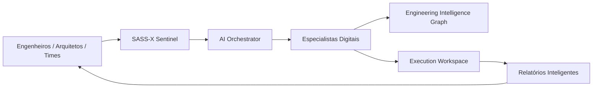

# 🛰️ SASS-X Sentinel

# Autonomous Software Engineering Platform

<p align="center">

**Uma plataforma de Engenharia de Software Autônoma baseada em Inteligência Artificial Multiagente capaz de compreender, auditar, proteger e evoluir aplicações corporativas continuamente.**

*"Transformando conhecimento técnico em decisões inteligentes."*

</p>

---

# 🌎 O desafio da Engenharia de Software moderna

O software evoluiu.

Nas últimas décadas, saímos de aplicações simples para ecossistemas altamente distribuídos:

* Microsserviços;
* Kubernetes;
* Cloud Computing;
* APIs;
* Mensageria;
* Containers;
* DevSecOps;
* GitOps;
* Observabilidade;
* Inteligência Artificial;
* Arquiteturas distribuídas.

Essa evolução trouxe novos níveis de capacidade.

Mas também trouxe um novo problema:

## A complexidade ultrapassou a capacidade humana de análise manual.

---

Uma simples alteração em produção pode envolver:

```
Código

 ↓

API

 ↓

Microsserviços

 ↓

Banco de Dados

 ↓

Mensageria

 ↓

Cloud

 ↓

Infraestrutura

 ↓

Observabilidade

 ↓

Segurança

 ↓

Usuário final
```

Cada equipe possui uma visão parcial.

Cada ferramenta possui informações isoladas.

Cada especialista possui conhecimento específico.

Mas alguém precisa conectar tudo.

---

# ❓ As perguntas que empresas enfrentam diariamente

* Minha aplicação está segura?
* Minha arquitetura está preparada para crescer?
* Esta alteração aumenta minha dívida técnica?
* Existe risco de incidente?
* Minha aplicação segue boas práticas?
* Onde estão os maiores riscos?
* Qual correção deve ser priorizada?
* O que minha equipe ainda não percebeu?

Hoje essas respostas dependem principalmente de especialistas humanos.

Mas especialistas experientes são limitados.

O software continua crescendo.

---

# 💡 O problema não é falta de ferramentas.

# É excesso de informações desconectadas.

Empresas utilizam diversas soluções:

* SonarQube;
* Snyk;
* Semgrep;
* Dependabot;
* OWASP Dependency Check;
* GitHub;
* GitLab;
* Azure DevOps;
* Jira;
* Confluence;
* Elastic;
* New Relic;
* Dynatrace;
* Ferramentas de IA.

Cada ferramenta resolve uma parte.

Cada ferramenta gera dados.

Cada ferramenta possui seu próprio contexto.

O desafio moderno não é coletar informação.

É transformar informação em decisão.

---

# 🚀 A nova geração da Engenharia de Software

Imagine possuir uma equipe digital permanente formada por especialistas que trabalham continuamente:

🧠 Um arquiteto de software

🔐 Um especialista em segurança

⚙️ Um engenheiro DevOps

📊 Um especialista em observabilidade

🚀 Um especialista em performance

🏗 Um especialista em arquitetura

☁️ Um especialista Cloud

🛡 Um especialista LGPD

🧪 Um especialista em qualidade

Todos analisando a aplicação.

Todos compartilhando conhecimento.

Todos produzindo uma visão única.

---

# Essa é a proposta do SASS-X Sentinel.

---

# 🛰️ O que é o SASS-X Sentinel?

O **SASS-X Sentinel** é uma plataforma de Engenharia de Software Autônoma baseada em Inteligência Artificial Multiagente.

Seu objetivo é funcionar como um **sentinela digital da engenharia**, acompanhando continuamente aplicações corporativas e identificando oportunidades de melhoria.

A plataforma analisa:

* Arquitetura;
* Segurança;
* Qualidade;
* Código-fonte;
* Performance;
* Observabilidade;
* APIs;
* Banco de Dados;
* Microsserviços;
* Cloud;
* DevOps;
* Compliance;
* Governança.

---

# Muito além de um Code Review

O Sentinel não substitui ferramentas existentes.

Ele conecta essas ferramentas.

Ele atua como uma camada inteligente acima do ecossistema tecnológico existente.

Enquanto ferramentas tradicionais respondem:

> "Existe uma vulnerabilidade?"

O Sentinel busca responder:

> "Qual o impacto desta vulnerabilidade, por que ela existe, qual risco representa, qual prioridade possui e qual a melhor estratégia para corrigir?"

---

# 🧠 Como o Sentinel funciona

A plataforma utiliza um modelo baseado em:

```
Usuário

   ↓

Orquestrador Inteligente

   ↓

Especialistas Digitais

   ↓

Evidências Técnicas

   ↓

Consolidação

   ↓

Conhecimento

   ↓

Relatórios e Recomendações
```

---

# 🏗 Arquitetura resumida



---

# 🤖 Sistema Multiagente

Cada agente possui uma especialidade.

Exemplos:

| Especialista        | Responsabilidade          |
| ------------------- | ------------------------- |
| Security Agent      | Vulnerabilidades e riscos |
| OWASP Agent         | Segurança Web             |
| Quality Agent       | Clean Code e qualidade    |
| Architecture Agent  | Padrões arquiteturais     |
| Performance Agent   | Gargalos                  |
| Observability Agent | Logs, métricas e tracing  |
| DevOps Agent        | Pipelines e entrega       |
| Cloud Agent         | Boas práticas cloud       |
| Compliance Agent    | Governança                |

Os especialistas trabalham juntos através de um orquestrador inteligente.

---

# 🧬 Diferenciais da Plataforma

## Evidência antes de opinião

Nenhuma recomendação existe sem evidência técnica.

---

## Inteligência especializada

Cada agente possui uma missão clara.

---

## Conhecimento acumulativo

O Sentinel aprende com execuções anteriores através do Engineering Knowledge Graph.

---

## Rastreamento completo

Cada análise possui:

* Contexto;
* Evidências;
* Decisões;
* Checkpoints;
* Relatórios.

---

## Human-in-the-loop

A IA recomenda.

A engenharia decide.

Mudanças críticas permanecem sob aprovação humana.

---

# 📊 Status da Plataforma

| Capacidade                 | Status          |
| -------------------------- | --------------- |
| Arquitetura Multiagente    | ✅ Implementada  |
| Orquestração Inteligente   | ✅ Implementada  |
| Framework de Especialistas | ✅ Implementado  |
| Workspace Auditável        | ✅ Implementado  |
| Knowledge Graph            | ✅ Implementado  |
| Relatórios Inteligentes    | ✅ Implementado  |
| Segurança e Governança     | ✅ Estruturado   |
| Evolução Enterprise        | 🚀 Em andamento |

---

# 🎯 Para quem foi criado?

O Sentinel foi desenvolvido para organizações que tratam software como ativo estratégico.

Público:

* CTOs;
* Arquitetos de Software;
* Staff Engineers;
* Tech Leads;
* Times DevSecOps;
* Times SRE;
* Desenvolvedores;
* Empresas com ambientes complexos.

---

# 🌎 Casos de uso

## Auditoria contínua

Análise automática de aplicações.

---

## Modernização de sistemas legados

Identificação de riscos e oportunidades.

---

## Segurança preventiva

Detecção antecipada de vulnerabilidades.

---

## Governança arquitetural

Garantia de padrões corporativos.

---

## DevSecOps inteligente

Integração ao ciclo de entrega.

---

## Apoio à decisão técnica

Transformação de dados em estratégia.

---

# 📚 Documentação da Plataforma

A documentação foi organizada como uma visão completa do produto.

| Documento                                                                 | Objetivo                    |
| ------------------------------------------------------------------------- | --------------------------- |
| [01-vision.md](docs/01-vision.md)                                         | Visão estratégica           |
| [02-business-problem.md](docs/02-business-problem.md)                     | Problema de negócio         |
| [03-how-it-works.md](docs/03-how-it-works.md)                             | Funcionamento               |
| [04-architecture.md](docs/04-architecture.md)                             | Arquitetura                 |
| [05-multi-agent-system.md](docs/05-multi-agent-system.md)                 | Sistema multiagente         |
| [06-engineering-knowledge-flow.md](docs/06-engineering-knowledge-flow.md) | Fluxo de conhecimento       |
| [07-execution-flow.md](docs/07-execution-flow.md)                         | Fluxo operacional           |
| [08-security.md](docs/08-security.md)                                     | Segurança                   |
| [09-observability.md](docs/09-observability.md)                           | Observabilidade             |
| [10-integrations.md](docs/10-integrations.md)                             | Integrações                 |
| [11-enterprise.md](docs/11-enterprise.md)                                 | Arquitetura enterprise      |
| [12-use-cases.md](docs/12-use-cases.md)                                   | Casos de uso                |
| [13-token-optimization.md](docs/13-token-optimization.md)                 | Eficiência de IA            |
| [14-roadmap.md](docs/14-roadmap.md)                                       | Evolução futura             |
| [15-faq.md](docs/15-faq.md)                                               | Perguntas frequentes        |
| [16-runtime-architecture.md](docs/16-runtime-architecture.md)             | Motor de execução           |
| [17-knowledge-graph.md](docs/17-knowledge-graph.md)                       | Memória organizacional      |
| [18-workspace.md](docs/18-workspace.md)                                   | Auditoria e rastreabilidade |
| [19-agent-framework.md](docs/19-agent-framework.md)                       | Framework de especialistas  |

---

# 🤝 Construindo o futuro da Engenharia

O SASS-X Sentinel representa uma nova visão:

Software não deve ser apenas desenvolvido.

Ele deve ser compreendido.

Monitorado.

Protegido.

Evoluído.

---

A próxima geração da engenharia será construída pela colaboração entre:

**Conhecimento humano + Inteligência Artificial + Automação inteligente**

---

# 🛰️ SASS-X Sentinel

## O sentinela digital que acompanha a evolução do software.

*"O código muda todos os dias.
O conhecimento precisa evoluir junto."*

---

**Versão:** 4.0
**Categoria:** Engineering Intelligence Platform
**Status:** Em evolução contínua 🚀
