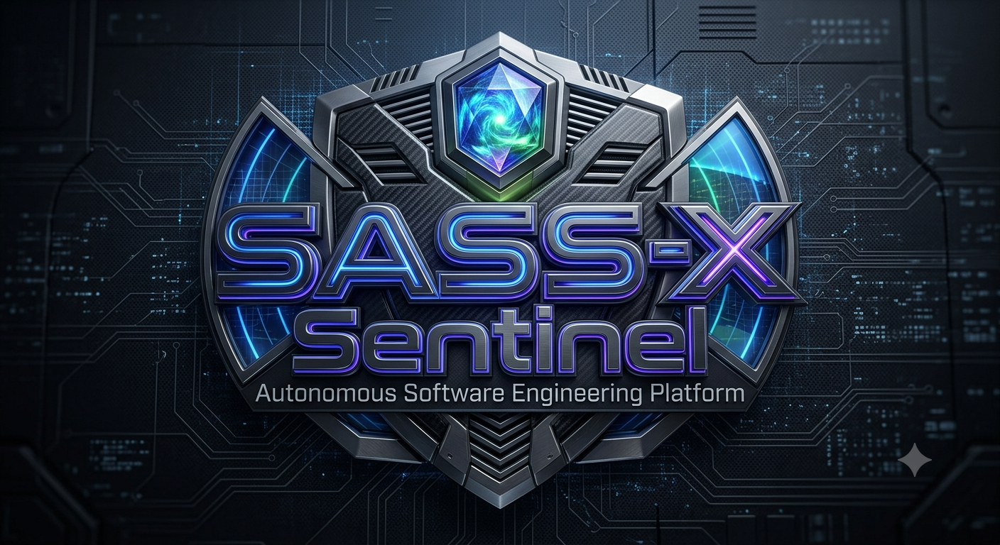
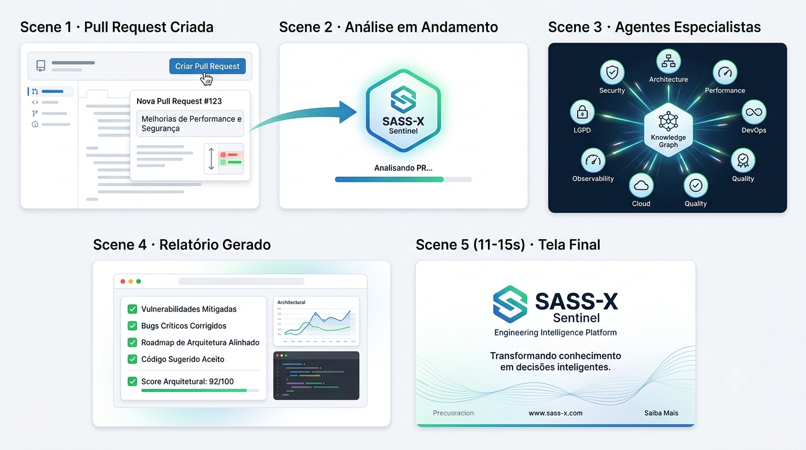
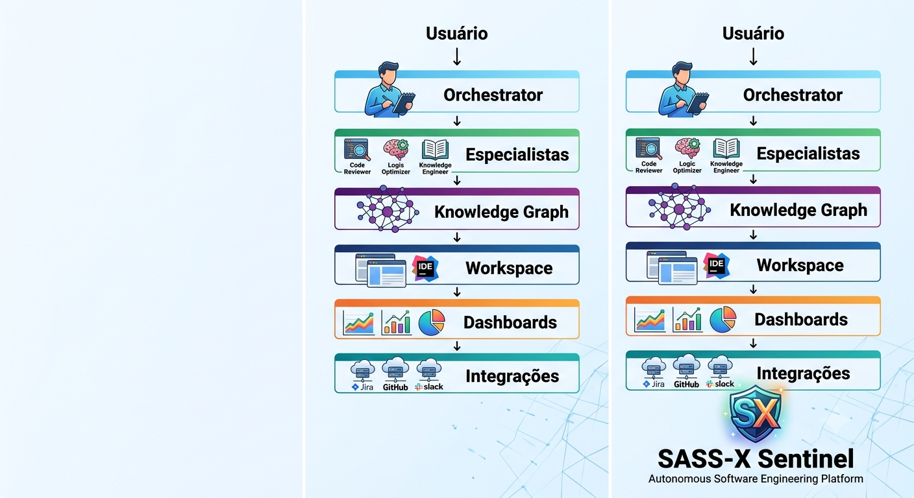

<p align="center">
    
</p>

# 🛰️ SASS-X Sentinel

## Autonomous Software Engineering Platform

<p align="center">

**Uma plataforma de Engenharia de Software Autônoma baseada em Inteligência Artificial Multiagente capaz de compreender, auditar, proteger, evoluir e apoiar decisões técnicas durante todo o ciclo de vida de aplicações corporativas.**

*"Transformando conhecimento técnico em decisões inteligentes."*

</p>

<p align="center">
    
</p>

---

# 🌎 O software mudou. A Engenharia também.

A Engenharia de Software vive uma das maiores transformações de sua história.

Nas últimas décadas deixamos de construir aplicações monolíticas simples para operar ecossistemas altamente distribuídos compostos por centenas de componentes, serviços e integrações.

Hoje uma única aplicação pode envolver simultaneamente:

- Microsserviços
- Kubernetes
- Containers
- APIs REST e eventos
- Mensageria
- Banco de Dados
- Cloud Computing
- DevSecOps
- GitOps
- Observabilidade
- Inteligência Artificial
- Infraestrutura como Código
- Compliance
- Governança

Cada nova tecnologia resolveu um problema.

Mas também aumentou exponencialmente a complexidade da Engenharia.

O resultado é um cenário onde compreender completamente uma aplicação tornou-se praticamente impossível para uma única pessoa.

---

# O verdadeiro desafio

Uma simples alteração em produção pode atravessar dezenas de componentes antes de chegar ao usuário.

```text
             Código
                │
                ▼
              APIs
                │
                ▼
         Microsserviços
                │
                ▼
         Banco de Dados
                │
                ▼
          Mensageria
                │
                ▼
              Cloud
                │
                ▼
        Infraestrutura
                │
                ▼
        Observabilidade
                │
                ▼
          Segurança
                │
                ▼
         Usuário Final
```

Nesse cenário surgem alguns desafios inevitáveis.

Cada equipe possui apenas parte do conhecimento.

Cada ferramenta apresenta apenas parte das informações.

Cada especialista domina apenas uma área da engenharia.

Mas as decisões precisam considerar o sistema como um todo.

---

# ❓ As perguntas que toda organização precisa responder

Todos os dias equipes de Engenharia enfrentam perguntas como:

- Esta aplicação realmente está segura?
- Nossa arquitetura suporta o crescimento esperado?
- Esta Pull Request aumenta a dívida técnica?
- Existe risco operacional escondido?
- Estamos seguindo boas práticas arquiteturais?
- Quais componentes representam maior risco?
- O que devemos corrigir primeiro?
- Qual decisão trará maior retorno técnico?
- Existe algum problema que ainda ninguém percebeu?

Responder essas perguntas exige experiência.

Muita experiência.

E normalmente depende de Arquitetos de Software, Staff Engineers, Tech Leads, especialistas DevSecOps, SREs e profissionais extremamente experientes.

O problema é que conhecimento especializado continua sendo um recurso escasso.

Enquanto isso, os sistemas continuam crescendo.

---

# O problema não é falta de ferramentas.

## O problema é excesso de informações desconectadas.

Empresas modernas utilizam diariamente dezenas de plataformas especializadas.

- GitHub
- GitLab
- Azure DevOps
- Jira
- Confluence
- SonarQube
- Semgrep
- Snyk
- OWASP Dependency Check
- Elastic
- New Relic
- Dynatrace
- Kubernetes
- AWS
- Azure
- IDEs com Inteligência Artificial

Cada ferramenta resolve um problema específico.

Cada ferramenta produz milhares de dados.

Cada ferramenta utiliza métricas próprias.

Cada ferramenta fala sua própria linguagem.

No final do dia alguém precisa reunir todas essas informações.

Interpretar.

Correlacionar.

Priorizar.

Transformar dados em decisões.

Esse trabalho ainda é predominantemente manual.

---

# Imagine uma equipe de especialistas trabalhando continuamente.

Agora imagine possuir uma equipe formada pelos melhores especialistas da Engenharia de Software trabalhando vinte e quatro horas por dia.

Sem interrupções.

Sem perda de contexto.

Compartilhando conhecimento continuamente.

Imagine ter permanentemente disponível:

🧠 Um Arquiteto de Software

🔐 Um Especialista em Segurança

⚙️ Um Engenheiro DevOps

📊 Um Especialista em Observabilidade

🚀 Um Especialista em Performance

☁️ Um Especialista Cloud

🛡️ Um Especialista em LGPD

🧪 Um Especialista em Qualidade

🏗️ Um Especialista em Arquitetura

📦 Um Especialista em Microsserviços

Todos analisando exatamente a mesma aplicação.

Todos compartilhando contexto.

Todos colaborando entre si.

Todos produzindo uma única resposta consolidada.

Não dezenas de relatórios.

Uma única visão.

Baseada em evidências.

Com prioridades.

Com riscos.

Com impacto.

Com recomendações.

Com plano de ação.

---

# 🛰️ O que é o SASS-X Sentinel?

O **SASS-X Sentinel** é uma **Engineering Intelligence Platform** construída para atuar como um **sentinela digital da Engenharia de Software**.

Em vez de executar verificações isoladas, a plataforma observa continuamente todo o ecossistema tecnológico, compreende o contexto da aplicação e coordena especialistas digitais capazes de produzir análises muito mais completas do que ferramentas tradicionais conseguem entregar individualmente.

Seu objetivo é apoiar organizações na evolução contínua de seus sistemas por meio de Inteligência Artificial Multiagente, conhecimento compartilhado e decisões orientadas por evidências.

<p align="center">
    
</p>

O Sentinel pode analisar continuamente aspectos como:

- Arquitetura
- Código-fonte
- Segurança
- DevSecOps
- Observabilidade
- Performance
- APIs
- Microsserviços
- Banco de Dados
- Cloud
- Kubernetes
- Governança
- Compliance
- Fluxos de negócio
- Qualidade de Software

Mais do que identificar problemas, a plataforma busca compreender sua origem, avaliar impactos, correlacionar evidências e propor estratégias de evolução.

---

# Muito mais do que um Code Review

O Sentinel não foi criado para substituir ferramentas já consolidadas.

Seu propósito é muito maior.

Ele funciona como uma camada inteligente posicionada acima de todo o ecossistema de Engenharia.

Enquanto scanners tradicionais respondem perguntas específicas, o Sentinel busca compreender o cenário completo.

Em vez de simplesmente informar:

> "Existe uma vulnerabilidade."

O Sentinel procura responder:

- Qual é o impacto dessa vulnerabilidade?
- Qual componente será afetado?
- Qual a prioridade real?
- Existe correlação com outros problemas?
- Qual é o risco para o negócio?
- Como corrigir?
- Qual o esforço estimado?
- Qual o melhor plano de evolução?

A plataforma transforma milhares de informações técnicas dispersas em conhecimento estruturado capaz de apoiar decisões estratégicas.

---

# Engenharia orientada por Inteligência

O SASS-X Sentinel parte de um princípio simples.

Ferramentas geram dados.

Especialistas geram conhecimento.

O Sentinel conecta esses dois mundos.

Ele utiliza Inteligência Artificial para interpretar informações produzidas por diferentes tecnologias, compartilhar contexto entre especialistas digitais e construir uma visão única da aplicação.

O resultado não é apenas uma lista de problemas.

É um diagnóstico completo da Engenharia acompanhado por recomendações, evidências, prioridades e planos de evolução.

---
# 🏗️ Como o SASS-X Sentinel funciona

O SASS-X Sentinel foi concebido para atuar como uma plataforma inteligente de Engenharia de Software capaz de compreender um ambiente corporativo de forma muito semelhante à atuação de uma equipe altamente especializada.

Enquanto ferramentas tradicionais executam verificações independentes, o Sentinel trabalha continuamente correlacionando informações, compartilhando contexto entre especialistas digitais e produzindo uma visão consolidada sobre a saúde da aplicação.

Toda execução segue um fluxo organizado, previsível e rastreável.

Cada etapa possui responsabilidades bem definidas.

Cada decisão pode ser auditada.

Cada recomendação possui evidências.

---

# O ciclo de inteligência da plataforma

A plataforma opera seguindo um ciclo contínuo de engenharia.

```text
Coleta
    │
    ▼
Compreensão
    │
    ▼
Planejamento
    │
    ▼
Especialistas
    │
    ▼
Correlação
    │
    ▼
Priorização
    │
    ▼
Relatório
    │
    ▼
Evolução
```

Esse ciclo permite que o conhecimento produzido durante uma análise seja reutilizado nas próximas execuções, tornando a plataforma continuamente mais eficiente.

---

# Uma arquitetura baseada em especialistas

Em vez de uma única Inteligência Artificial tentando resolver todos os problemas da Engenharia de Software, o Sentinel distribui responsabilidades entre especialistas digitais.

Cada agente possui um domínio específico de conhecimento.

Cada especialista entende profundamente um conjunto de tecnologias.

Cada análise acontece de forma colaborativa.

Ao final, todas as descobertas são consolidadas em uma única resposta.

Essa estratégia reduz ruído, melhora a qualidade das recomendações e aumenta significativamente a precisão das análises.

---

# Arquitetura resumida

A plataforma foi construída sobre uma arquitetura em camadas, separando claramente responsabilidades, conhecimento e execução.

<p align="center">
    
</p>

Em alto nível, a arquitetura pode ser resumida da seguinte forma:

```text
                    Usuário

                       │

                       ▼

              SASS-X Sentinel

                       │

        ┌──────────────┼──────────────┐

        ▼              ▼              ▼

 Planejamento     Inteligência     Conhecimento

                       │

                       ▼

             Especialistas Digitais

                       │

                       ▼

        Consolidação de Evidências

                       │

                       ▼

      Relatórios • Roadmaps • Insights
```

Essa separação permite que a plataforma evolua continuamente sem comprometer sua arquitetura principal.

---

# Inteligência Multiagente

O coração do Sentinel é seu sistema de Inteligência Multiagente.

Em vez de uma IA generalista tentando compreender todos os aspectos da Engenharia, a plataforma distribui o trabalho entre especialistas digitais independentes.

Cada agente atua como um profissional experiente de uma área específica.

Alguns exemplos:

- Arquiteto de Software
- Especialista DevSecOps
- Especialista OWASP
- Especialista LGPD
- Especialista Kubernetes
- Especialista Cloud
- Especialista Performance
- Especialista em APIs
- Especialista em Microsserviços
- Especialista em Banco de Dados
- Especialista Observabilidade
- Especialista Clean Code
- Especialista SOLID
- Especialista Design Patterns
- Especialista CI/CD

Todos trabalham simultaneamente.

Todos compartilham contexto.

Todos colaboram entre si.

---

# O conhecimento é compartilhado

Uma das maiores diferenças do Sentinel é que seus especialistas não trabalham isoladamente.

Cada descoberta realizada durante uma análise pode enriquecer imediatamente o trabalho dos demais agentes.

Por exemplo:

O especialista em Observabilidade pode identificar uma falha de rastreabilidade.

Essa informação passa automaticamente para o especialista de Arquitetura.

Que compartilha contexto com o especialista DevSecOps.

Que também informa o especialista de Performance.

Ao final, a plataforma deixa de produzir quatro problemas isolados.

Ela produz um único diagnóstico técnico muito mais completo.

---

# Engenharia orientada por evidências

Toda recomendação produzida pelo Sentinel precisa ser sustentada por evidências concretas.

Nenhuma conclusão é baseada apenas em interpretação.

Cada recomendação pode conter informações como:

- Arquivo analisado
- Linha do código
- Evidência encontrada
- Impacto técnico
- Impacto para o negócio
- Nível de severidade
- Especialista responsável
- Grau de confiança
- Sugestão de correção
- Prioridade

Isso torna toda recomendação auditável.

---

# Uma única visão da aplicação

Durante uma análise centenas de informações podem ser produzidas.

Sem uma estratégia de consolidação isso rapidamente se transforma em dezenas de relatórios desconectados.

O Sentinel resolve esse problema através de uma camada de consolidação inteligente.

Ela é responsável por:

- remover informações duplicadas;
- correlacionar descobertas semelhantes;
- eliminar conflitos entre especialistas;
- consolidar riscos;
- calcular prioridades;
- produzir um plano único de evolução.

O resultado é uma visão executiva da Engenharia.

Muito mais simples de interpretar.

Muito mais útil para tomada de decisão.

---

# Muito além da análise de código

Embora o código-fonte seja uma das principais fontes de informação da plataforma, ele representa apenas uma parte do conhecimento necessário para compreender um sistema corporativo.

O Sentinel também pode considerar informações provenientes de:

- arquitetura;
- pipelines;
- observabilidade;
- infraestrutura;
- ambientes cloud;
- logs;
- eventos;
- APIs;
- métricas;
- documentação técnica;
- requisitos de negócio;
- integrações externas;
- plataformas DevOps.

Isso permite compreender não apenas "como o código foi escrito", mas também "como o sistema realmente se comporta".

---

# Principais capacidades da plataforma

Entre as principais capacidades do Sentinel estão:

## 🏗️ Arquitetura

- avaliação arquitetural;
- identificação de gargalos;
- detecção de acoplamentos excessivos;
- análise de evolução arquitetural;
- apoio à modernização.

---

## 🔐 Segurança

- OWASP Top 10;
- DevSecOps;
- LGPD;
- análise de vulnerabilidades;
- gestão de riscos;
- compliance.

---

## 📊 Observabilidade

- logging;
- métricas;
- tracing;
- APM;
- correlação de eventos;
- SRE.

---

## ⚙️ Engenharia

- Clean Code;
- SOLID;
- Design Patterns;
- dívida técnica;
- qualidade de software;
- arquitetura evolutiva.

---

## ☁️ Plataforma

- Kubernetes;
- Microsserviços;
- Cloud Computing;
- APIs;
- Containers;
- Integrações.

---

## 🤖 Inteligência

- Inteligência Multiagente;
- Knowledge Graph;
- compartilhamento de contexto;
- memória organizacional;
- aprendizado contínuo;
- priorização inteligente.

---

# Muito mais do que automação

O Sentinel não busca apenas automatizar tarefas repetitivas.

Seu propósito é elevar o nível das decisões técnicas tomadas durante todo o ciclo de vida do software.

Em vez de simplesmente acelerar atividades, a plataforma procura aumentar a qualidade da Engenharia.

Automação é consequência.

Inteligência é o objetivo.

---

# Os cinco princípios fundamentais

Toda decisão produzida pelo Sentinel segue cinco princípios que orientam toda a plataforma.

## Evidências acima de opiniões

Toda recomendação precisa ser sustentada por fatos verificáveis.

---

## Especialização

Cada agente possui responsabilidades claramente definidas.

---

## Conhecimento compartilhado

Especialistas colaboram continuamente entre si.

---

## Priorização inteligente

Nem todo problema possui o mesmo impacto.

O Sentinel ajuda a decidir o que realmente importa.

---

## Engenharia sob controle humano

A Inteligência Artificial recomenda.

A Engenharia decide.

O ser humano permanece responsável pelas decisões críticas.

# 🚀 O que torna o SASS-X Sentinel diferente?

O mercado possui excelentes ferramentas de Engenharia de Software.

Scanners de segurança.

Plataformas de observabilidade.

Ferramentas de qualidade.

Analisadores estáticos.

Plataformas DevOps.

Soluções baseadas em Inteligência Artificial.

Todas elas são extremamente importantes.

O problema é que cada uma responde apenas parte das perguntas.

Nenhuma delas possui uma visão completa da Engenharia.

O SASS-X Sentinel foi criado exatamente para preencher essa lacuna.

Sua proposta não é substituir ferramentas existentes.

Sua missão é conectá-las, compreender seus resultados e transformar milhares de informações técnicas em conhecimento estratégico para Engenharia.

---

# Uma plataforma acima das ferramentas

Enquanto ferramentas tradicionais trabalham isoladamente, o Sentinel atua como uma camada inteligente sobre todo o ecossistema tecnológico.

```text
                 Engenharia

                      │

                      ▼

        GitHub • GitLab • Azure DevOps

                      │

                      ▼

 SonarQube • Snyk • Semgrep • Dependency Check

                      │

                      ▼

 Elastic • New Relic • Dynatrace • Grafana

                      │

                      ▼

 Kubernetes • Cloud • APIs • Banco de Dados

                      │

                      ▼

           SASS-X Sentinel Intelligence

                      │

                      ▼

     Conhecimento • Insights • Decisões
```

O Sentinel não compete com essas plataformas.

Ele potencializa todas elas.

---

# O diferencial não é a Inteligência Artificial.

É a Engenharia.

Hoje praticamente toda ferramenta afirma utilizar Inteligência Artificial.

Entretanto, poucas foram projetadas sob uma perspectiva genuinamente arquitetural.

O Sentinel foi concebido por um princípio diferente.

A Inteligência Artificial é apenas um meio.

O verdadeiro produto é Engenharia de Software.

Toda recomendação existe para apoiar decisões arquiteturais.

Toda análise busca responder perguntas que realmente importam para equipes técnicas.

Toda conclusão procura gerar valor para o negócio.

---

# Engenharia baseada em contexto

Uma vulnerabilidade isolada raramente representa toda a história.

Um gargalo de performance pode ser consequência de uma decisão arquitetural.

Uma falha de observabilidade pode esconder um problema operacional.

Um alto consumo de recursos pode estar relacionado a uma estratégia inadequada de microsserviços.

O Sentinel procura compreender essas relações.

Ele correlaciona informações.

Compartilha conhecimento.

Identifica padrões.

Produz uma visão sistêmica da aplicação.

---

# De dados para conhecimento

Ferramentas normalmente produzem dados.

O Sentinel produz conhecimento.

A diferença parece pequena.

Mas muda completamente a tomada de decisão.

Em vez de entregar milhares de alertas, a plataforma responde perguntas como:

- O que realmente representa risco?
- O que deve ser corrigido primeiro?
- Qual componente está degradando toda a arquitetura?
- Existe relação entre esses problemas?
- Qual decisão oferece maior retorno técnico?
- Como reduzir dívida técnica sem comprometer entregas?

Essas respostas dificilmente seriam produzidas por ferramentas isoladas.

---

# Inteligência colaborativa

Cada especialista digital possui competências específicas.

Nenhum agente trabalha sozinho.

Durante toda execução existe troca contínua de conhecimento.

```text
Especialista Segurança
          │
          ▼
Especialista Arquitetura
          │
          ▼
Especialista Observabilidade
          │
          ▼
Especialista Performance
          │
          ▼
Especialista DevOps
          │
          ▼
Especialista Cloud

          ▼

Conhecimento Compartilhado
```

Essa colaboração permite que um mesmo problema seja analisado sob diferentes perspectivas.

O resultado é muito mais consistente.

---

# Uma plataforma construída para evoluir

O Sentinel não foi desenvolvido para resolver apenas os desafios atuais da Engenharia.

Sua arquitetura foi desenhada para crescer continuamente.

Novos especialistas podem ser incorporados sem alterar a estrutura principal.

Novas integrações podem ser adicionadas de forma incremental.

Novos mecanismos de IA podem substituir tecnologias existentes.

Novos modelos de análise podem coexistir dentro da mesma plataforma.

Essa característica torna o Sentinel uma plataforma preparada para acompanhar a evolução constante da Engenharia de Software.

---

# Muito além do desenvolvimento

Embora desenvolvedores sejam usuários naturais da plataforma, seu alcance é significativamente maior.

O Sentinel pode apoiar decisões em diferentes níveis da organização.

## Desenvolvedores

Recebem recomendações técnicas durante a implementação.

---

## Tech Leads

Obtêm uma visão consolidada da qualidade técnica das equipes.

---

## Arquitetos

Avaliam continuamente a evolução arquitetural dos sistemas.

---

## DevSecOps

Recebem análises preventivas sobre riscos de segurança.

---

## Equipes SRE

Compreendem melhor comportamento operacional, incidentes e observabilidade.

---

## Gestores de Engenharia

Passam a visualizar indicadores estratégicos sobre maturidade técnica.

---

## CTOs

Obtêm uma visão executiva da evolução tecnológica da organização.

---

# Uma plataforma orientada ao ciclo completo da Engenharia

O Sentinel acompanha toda a jornada do software.

```text
Planejamento

      │

      ▼

Desenvolvimento

      │

      ▼

Code Review

      │

      ▼

Integração Contínua

      │

      ▼

Deploy

      │

      ▼

Produção

      │

      ▼

Observabilidade

      │

      ▼

Aprendizado Contínuo

      │

      ▼

Nova Evolução
```

Cada etapa gera novos conhecimentos.

Cada novo conhecimento fortalece futuras análises.

A plataforma torna-se continuamente mais inteligente.

---

# Para quem o Sentinel foi criado

O SASS-X Sentinel foi concebido para organizações que enxergam software como um ativo estratégico.

É especialmente indicado para:

- Grandes empresas de tecnologia;
- Bancos;
- Fintechs;
- Empresas de Saúde;
- Governo;
- Varejo;
- Indústria;
- Empresas SaaS;
- Consultorias de Tecnologia;
- Fábricas de Software;
- Centros de Excelência;
- Squads Ágeis;
- Plataformas Enterprise.

Independentemente do segmento, o objetivo permanece o mesmo.

Reduzir riscos.

Melhorar decisões.

Aumentar a qualidade da Engenharia.

---

# Conheça toda a documentação da plataforma

Esta documentação foi organizada para apresentar o Sentinel desde sua visão estratégica até os detalhes técnicos de sua arquitetura.

Cada documento aprofunda uma dimensão específica da plataforma.

## 📚 Documentação Oficial

| Documento | O que você encontrará |
|------------|----------------------|
| **01-platform-vision.md** | A visão estratégica que originou o SASS-X Sentinel e o futuro da Engenharia de Software. |
| **02-business-challenges.md** | Os desafios enfrentados pelas organizações modernas e como o Sentinel os resolve. |
| **03-sentinel-operating-model.md** | O modelo operacional completo da plataforma, do início ao fim de uma análise. |
| **04-platform-architecture.md** | A arquitetura lógica da solução e seus principais componentes. |
| **05-multi-agent-intelligence.md** | Como dezenas de especialistas digitais colaboram para produzir inteligência. |
| **06-engineering-knowledge-flow.md** | O fluxo de conhecimento entre especialistas, memória organizacional e aprendizado contínuo. |
| **07-execution-lifecycle.md** | Todo o ciclo de vida de execução de uma solicitação dentro da plataforma. |
| **08-security-governance.md** | Segurança corporativa, governança, compliance e princípios DevSecOps. |
| **09-observability-intelligence.md** | Observabilidade inteligente aplicada à Engenharia de Software moderna. |
| **10-ecosystem-integrations.md** | Integrações com GitHub, Azure DevOps, Kubernetes, Elastic, New Relic e demais plataformas. |
| **11-enterprise-capabilities.md** | Capacidades Enterprise voltadas para organizações de grande porte. |
| **12-business-use-cases.md** | Casos reais de utilização da plataforma em diferentes cenários corporativos. |
| **13-ai-efficiency-strategy.md** | Estratégias de otimização de contexto, cache e eficiência na utilização de IA. |
| **14-evolution-roadmap.md** | A visão de evolução da plataforma e seus próximos passos tecnológicos. |
| **15-community-and-contribution.md** | Como participar, colaborar e contribuir para a evolução do projeto. |
| **16-runtime-engine-architecture.md** | A arquitetura do motor de execução responsável pela orquestração dos especialistas. |
| **17-engineering-knowledge-graph.md** | O modelo de memória organizacional baseado em grafos de conhecimento. |
| **18-audit-workspace-model.md** | Estrutura de auditoria, rastreabilidade e organização dos artefatos gerados. |
| **19-agent-framework.md** | O framework responsável pela criação, evolução e especialização dos agentes inteligentes. |

---

# Documentos complementares

Além da documentação principal, este repositório disponibiliza materiais que explicam a filosofia, governança e evolução do projeto.

| Documento | Finalidade |
|------------|------------|
| **VISION.md** | Manifesto estratégico da plataforma. |
| **ENGINEERING_OPERATING_MODEL.md** | Modelo operacional de Engenharia adotado pelo Sentinel. |
| **ARCHITECTURE_DECISIONS.md** | Registro das principais decisões arquiteturais (ADRs). |
| **CHANGELOG.md** | Histórico de evolução do projeto. |
| **CONTRIBUTING.md** | Guia para contribuições da comunidade. |
| **LICENSE.md** | Licenciamento da plataforma. |

---

# Bem-vindo ao futuro da Engenharia de Software

A Engenharia moderna deixou de ser apenas desenvolvimento de código.

Hoje ela exige conhecimento compartilhado.

Contexto.

Especialização.

Colaboração.

Governança.

Observabilidade.

Segurança.

Arquitetura.

E, principalmente, inteligência aplicada às decisões.

O **SASS-X Sentinel** nasce exatamente com esse propósito.

Não apenas automatizar tarefas.

Mas elevar o nível da Engenharia de Software.

Transformando milhares de informações dispersas em conhecimento estruturado capaz de apoiar organizações na construção de sistemas mais seguros, resilientes, escaláveis e sustentáveis.

---

## Continue explorando

A documentação foi organizada para que cada capítulo aprofunde uma dimensão específica da plataforma.

Comece pela visão estratégica.

Compreenda os desafios.

Conheça a arquitetura.

Descubra como especialistas colaboram.

E acompanhe a construção de uma nova geração de plataformas inteligentes para Engenharia de Software.

**Bem-vindo ao universo do SASS-X Sentinel.**

---

## 👤 Autor & Engenharia

<table align="center">
  <tr>
    <td align="center">
      <a href="https://github.com/saulomcosta">
        <br />
        <sub><b>Saulo M. Costa</b></sub>
      </a>
    </td>
    <td>
      <h3><b>Senior Software Engineer | AI Solutions Architect</b></h3>
      <p>🚀 Especialista em Arquitetura de Software e na criação de Agentes de IA Autônomos.</p>
      <p>⚙️ Desenvolvendo sistemas altamente escaláveis e resilientes utilizando TypeScript, Java, AWS e Microsserviços.</p>
      <p>
        <a href="https://github.com/saulomcosta" target="_blank">
          
        </a>
        <a href="https://www.linkedin.com/in/saulo-m-costa/" target="_blank">
          
        </a>
      </p>
    </td>
  </tr>
