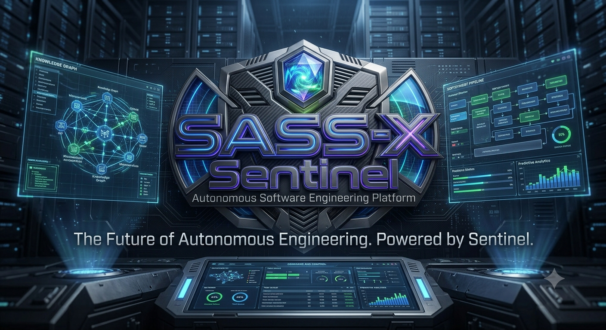

# 💼 O Problema de Negócio

## Por que organizações modernas precisam de Engenharia de Software Contínua

> *Toda empresa de tecnologia possui software. Poucas conseguem compreender completamente o software que possuem.*

<p align="center">
    
</p>

---

# O paradoxo da Engenharia Moderna

Nunca tivemos tantas ferramentas para desenvolver software.

Nunca tivemos tantos frameworks.

Nunca tivemos tanta capacidade computacional.

Nunca tivemos tantos recursos de observabilidade.

Mesmo assim, os incidentes continuam acontecendo.

As falhas continuam chegando à produção.

Os custos continuam aumentando.

Os projetos continuam acumulando dívida técnica.

O problema nunca foi falta de tecnologia.

O problema é que **a complexidade cresce mais rápido do que nossa capacidade de entendê-la**.

---

# A falsa sensação de controle

Uma organização normalmente acredita estar protegida porque utiliza diversas ferramentas especializadas.

Um ambiente corporativo típico pode possuir:

* Plataforma Git
* CI/CD
* SonarQube
* SAST
* DAST
* Scanner de Dependências
* Kubernetes
* Observabilidade
* APM
* SIEM
* Gestão de Vulnerabilidades
* Dashboards
* Logs Centralizados
* Métricas
* Tracing
* Alertas

Tudo isso é extremamente importante.

Mas nenhuma dessas ferramentas possui entendimento global do sistema.

Cada uma responde apenas uma pergunta.

Nenhuma responde:

> **"O software continua saudável?"**

---

# O verdadeiro custo da complexidade

O impacto da complexidade raramente aparece no orçamento.

Ele aparece de forma distribuída.

## Tempo perdido

Engenheiros gastam horas procurando a origem de problemas.

Arquitetos analisam dezenas de documentos antes de tomar decisões.

Tech Leads revisam centenas de Pull Requests.

Especialistas precisam interpretar informações provenientes de várias ferramentas diferentes.

Grande parte desse tempo não gera inovação.

Gera apenas entendimento.

---

## Conhecimento concentrado

Em praticamente toda empresa existem pessoas que "sabem como o sistema funciona".

Elas conhecem:

* Dependências ocultas
* Regras de negócio
* Limitações arquiteturais
* Decisões históricas
* Pontos frágeis
* Componentes críticos

Quando essas pessoas saem da organização, boa parte desse conhecimento desaparece com elas.

Reconstruí-lo pode levar meses — ou nunca acontecer.

---

## Dívida técnica invisível

Nem toda dívida técnica gera erro imediatamente.

Algumas permanecem ocultas durante anos.

Até que uma mudança aparentemente simples provoca um efeito cascata.

Quando isso acontece, normalmente a pergunta é:

> "Como ninguém percebeu isso antes?"

Na maioria das vezes, porque ninguém possuía visão completa do sistema.

---

# O custo dos incidentes

Um incidente raramente é causado por um único erro.

Na prática, ele costuma ser resultado da combinação de diversos fatores:

* Pequenas decisões arquiteturais.
* Débitos técnicos acumulados.
* Configurações inconsistentes.
* Falhas de observabilidade.
* Processos frágeis.
* Dependências vulneráveis.
* Ausência de documentação.
* Conhecimento disperso.

Cada problema, isoladamente, parece pequeno.

Juntos, tornam-se um incidente.

---

# Ferramentas identificam sintomas.

Engenharia identifica causas.

Imagine que uma aplicação apresente lentidão.

Uma ferramenta de APM informa aumento no tempo de resposta.

Outra mostra crescimento do consumo de CPU.

Outra aponta filas aumentando.

Outra registra milhares de logs.

Outra detecta consultas lentas.

Outra mostra aumento na utilização do banco.

Todas estão corretas.

Mas nenhuma explica o motivo.

Compreender a relação entre essas informações ainda depende de especialistas.

É exatamente essa correlação que o Sentinel busca automatizar.

---

# O desafio da priorização

Toda organização possui mais problemas do que capacidade para resolvê-los.

Portanto, a pergunta correta não é:

> "O que devemos corrigir?"

A pergunta correta é:

> "O que gera maior risco para o negócio?"

Sem priorização:

* tudo parece urgente;
* equipes trabalham por percepção;
* decisões variam conforme experiência individual;
* o backlog cresce continuamente.

O Sentinel organiza problemas por impacto, risco, criticidade, esforço estimado e evidências técnicas.

Isso permite transformar listas de problemas em planos de ação.

---

# A explosão da Inteligência Artificial

A chegada da IA aumentou significativamente a produtividade das equipes.

Mas também criou um novo desafio.

Código passou a ser produzido muito mais rápido.

Consequentemente:

* mais código precisa ser revisado;
* mais arquitetura precisa ser validada;
* mais segurança precisa ser analisada;
* mais integrações precisam ser compreendidas;
* mais conhecimento precisa ser compartilhado.

A velocidade de produção aumentou.

A velocidade de validação não.

Esse desequilíbrio tende a crescer nos próximos anos.

---

# O próximo gargalo não será escrever software.

Será compreender software.

À medida que modelos de IA tornam a implementação mais rápida, atividades como:

* análise arquitetural;
* governança;
* segurança;
* observabilidade;
* conformidade;
* documentação;
* gestão de conhecimento;

passam a consumir uma parcela cada vez maior do tempo das equipes.

A Engenharia de Software entra em uma nova fase.

A implementação deixa de ser o centro.

A compreensão torna-se o ativo mais valioso.

---

# Nossa hipótese

Acreditamos que equipes altamente produtivas precisarão de plataformas capazes de compreender continuamente o software produzido.

Não apenas revisar código.

Mas construir entendimento.

Relacionar informações.

Conectar especialistas.

Gerar conhecimento.

Priorizar decisões.

Documentar automaticamente.

E apoiar continuamente a evolução da arquitetura.

---

# Onde o SASS-X Sentinel se posiciona

O Sentinel atua como uma camada de inteligência entre as ferramentas existentes e as equipes de engenharia.

```text
                   Organização

                        │
                        ▼

            Equipes de Engenharia

                        │
                        ▼

             SASS-X Sentinel
      Plataforma de Engenharia Contínua

                        │
 ┌──────────────────────┼──────────────────────┐
 │                      │                      │
 ▼                      ▼                      ▼

Arquitetura        Segurança          Observabilidade

 ▼                      ▼                      ▼

Qualidade        Performance        Governança

 ▼                      ▼                      ▼

Cloud             DevOps              Compliance

 └──────────────────────┼──────────────────────┘
                        ▼

          Consolidação Inteligente

                        ▼

        Evidências + Priorização

                        ▼

          Roadmap de Evolução

                        ▼

           Engenharia Decidindo
```

O Sentinel não substitui ferramentas.

Ele organiza o conhecimento produzido por elas.

---

# Benefícios para diferentes perfis

## CTO

* maior previsibilidade técnica;
* redução de riscos;
* apoio à tomada de decisão;
* visão consolidada da engenharia.

---

## Diretor de Engenharia

* priorização baseada em evidências;
* redução de retrabalho;
* acompanhamento contínuo da arquitetura;
* maior alinhamento entre equipes.

---

## Staff Engineer

* visão sistêmica da aplicação;
* apoio arquitetural;
* identificação de riscos ocultos;
* documentação automática.

---

## Tech Lead

* revisões técnicas mais consistentes;
* menor esforço manual;
* maior velocidade nas análises.

---

## Desenvolvedor

* feedback rápido;
* recomendações contextualizadas;
* aprendizado contínuo;
* sugestões de melhoria.

---

# O resultado esperado

Nossa expectativa não é apenas encontrar problemas.

É permitir que organizações:

* compreendam melhor seus sistemas;
* preservem conhecimento técnico;
* reduzam riscos operacionais;
* acelerem decisões;
* evoluam arquiteturas continuamente;
* transformem engenharia em vantagem competitiva.

---

# Em resumo

O maior desafio das organizações modernas não é produzir software.

É manter esse software compreensível ao longo do tempo.

É exatamente nesse espaço que o SASS-X Sentinel foi concebido para atuar.

Uma plataforma que transforma dados técnicos dispersos em conhecimento estruturado, evidências confiáveis e decisões inteligentes.

---

## Próximo capítulo

➡ **03-sentinel-operating-model.md**

No próximo capítulo conheceremos como o SASS-X Sentinel funciona internamente, desde o recebimento de uma solicitação até a geração de relatórios, recomendações e planos de evolução arquitetural.
