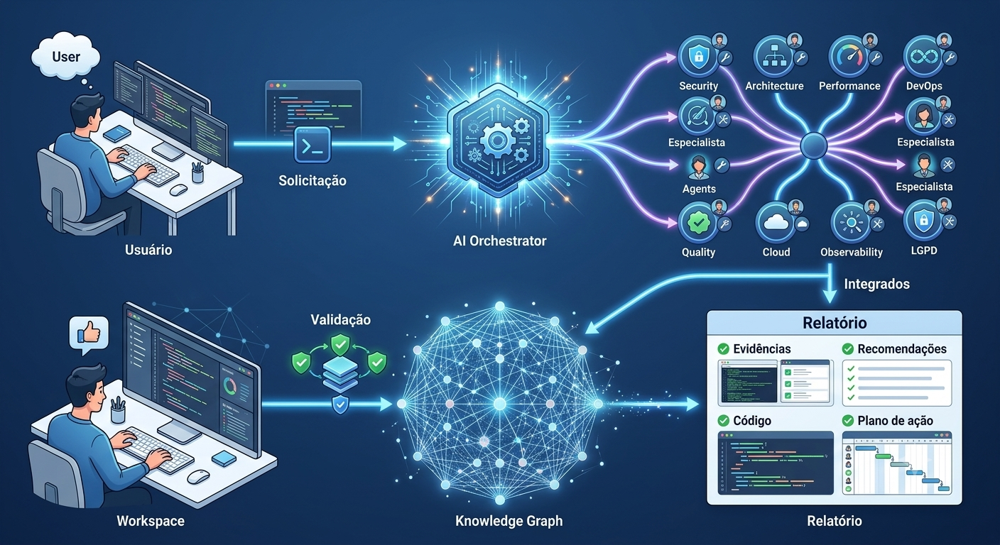

# ⚙️ Como o SASS-X Sentinel Funciona

## Da solicitação até uma decisão de engenharia baseada em evidências

> *O SASS-X Sentinel foi projetado para agir como um Sistema Operacional de Engenharia de Software. Em vez de executar uma única análise, ele coordena especialistas, consolida conhecimento e transforma informações dispersas em decisões técnicas confiáveis.*

<p align="center">
    
</p>

---

# A jornada de uma solicitação

Toda execução do Sentinel começa da mesma forma.

Alguém faz uma pergunta.

Essa pergunta pode ser extremamente simples.

> "Revise esta Pull Request."

Ou extremamente complexa.

> "Analise toda a arquitetura do módulo financeiro, valide segurança, performance, observabilidade, riscos operacionais e proponha um roadmap para os próximos três meses."

Independentemente da complexidade, o fluxo de processamento permanece o mesmo.

```text
Solicitação

      │

      ▼

Compreensão da Demanda

      │

      ▼

Planejamento

      │

      ▼

Seleção Inteligente de Especialistas

      │

      ▼

Execução Coordenada

      │

      ▼

Consolidação

      │

      ▼

Priorização

      │

      ▼

Relatório Executivo

      │

      ▼

Roadmap Técnico
```

O usuário vê apenas o resultado.

Internamente, dezenas de componentes trabalham de forma coordenada.

---

# Uma plataforma orientada por especialistas

O Sentinel não utiliza um único agente tentando resolver tudo.

Ele trabalha com especialistas independentes.

Assim como em uma empresa existe um especialista para cada área, o Sentinel organiza o conhecimento da mesma forma.

```text
                   Solicitação

                        │

                        ▼

                Orquestrador Central

                        │

      ┌─────────────────┼─────────────────┐

      ▼                 ▼                 ▼

 Segurança         Arquitetura       Qualidade

      ▼                 ▼                 ▼

 Performance     Observabilidade     DevOps

      ▼                 ▼                 ▼

 Banco de Dados     Cloud         Microsserviços

      ▼                 ▼                 ▼

 Compliance      APIs        Inteligência Artificial

      └─────────────────┼─────────────────┘

                        ▼

          Consolidação Inteligente

                        ▼

             Resposta Única
```

Cada especialista possui uma responsabilidade claramente definida.

Nenhum agente tenta assumir o papel de outro.

Essa separação reduz ambiguidades, melhora a qualidade das análises e facilita a evolução da plataforma.

---

# O papel do Orquestrador

O Orquestrador é o cérebro operacional da plataforma.

Sua responsabilidade não é executar análises técnicas.

Sua função é coordenar todo o processo.

Entre suas responsabilidades estão:

* interpretar a solicitação recebida;
* identificar o contexto da aplicação;
* selecionar especialistas relevantes;
* distribuir tarefas;
* controlar dependências;
* evitar análises duplicadas;
* gerenciar cache;
* acompanhar progresso;
* consolidar resultados;
* gerar o relatório final.

O Orquestrador nunca substitui especialistas.

Ele apenas coordena sua colaboração.

---

# O ciclo de vida de uma análise

Cada execução percorre um fluxo bem definido.

```text
Receber Solicitação

        │

        ▼

Validar Contexto

        │

        ▼

Existe Histórico?

        │

 ┌──────┴──────┐

 │             │

Sim           Não

 │             │

 ▼             ▼

Carrega     Cria Novo

Memória     Workspace

 │             │

 └──────┬──────┘

        ▼

Planejamento

        ▼

Selecionar Especialistas

        ▼

Executar Análises

        ▼

Consolidar Achados

        ▼

Eliminar Duplicidades

        ▼

Classificar Severidade

        ▼

Gerar Recomendações

        ▼

Gerar Roadmap

        ▼

Salvar Workspace

        ▼

Encerrar Execução
```

<p align="center">
    
</p>

Esse fluxo garante rastreabilidade completa.

Cada decisão tomada durante a execução pode ser auditada posteriormente.

---

# O Workspace

Cada solicitação gera um Workspace próprio.

O Workspace representa uma "fotografia" daquela execução.

Nele ficam armazenados:

* contexto da análise;
* histórico de decisões;
* achados;
* evidências;
* recomendações;
* roadmap;
* diário da execução;
* arquivos intermediários;
* checkpoints.

Exemplo:

```text
workspace/

└── ISSUE-1045/

      ├── contexto/

      ├── analises/

      ├── evidencias/

      ├── agentes/

      ├── relatorios/

      ├── roadmap/

      ├── memoria/

      └── diario.md
```

Isso permite interromper uma execução e retomá-la posteriormente sem perda de contexto.

---

# Engenharia baseada em evidências

Todo especialista trabalha seguindo exatamente o mesmo contrato.

Nenhuma conclusão é aceita sem evidências.

Cada achado precisa possuir:

```text
ID

Categoria

Especialista responsável

Severidade

Arquivo

Linha

Trecho analisado

Descrição

Impacto

Justificativa

Correção sugerida

Confiança

Estimativa

Referências
```

Esse contrato padronizado permite consolidar resultados produzidos por especialistas completamente diferentes.

---

# Consolidação Inteligente

Após todas as análises, inicia-se uma etapa fundamental.

A consolidação.

Nesse momento o Sentinel reúne centenas de observações produzidas pelos especialistas.

Problemas duplicados são agrupados.

Evidências complementares são unificadas.

Conflitos são resolvidos.

Achados são priorizados.

O objetivo não é gerar centenas de alertas.

O objetivo é produzir poucas recomendações realmente importantes.

```text
Especialista A

        │

Especialista B

        │

Especialista C

        │

Especialista D

        │

        ▼

Consolidação

        ▼

Remoção de Duplicidades

        ▼

Correlação

        ▼

Priorização

        ▼

Plano de Ação
```

---

# A memória da plataforma

Cada execução aumenta o conhecimento do Sentinel.

Informações podem ser reutilizadas posteriormente.

Exemplos:

* padrões arquiteturais;
* decisões anteriores;
* exceções conhecidas;
* convenções do projeto;
* regras de negócio;
* componentes críticos;
* histórico de análises.

Essa memória reduz retrabalho e melhora a qualidade das próximas execuções.

---

# Cache Inteligente

Nem toda análise precisa ser refeita.

O Sentinel identifica automaticamente informações que continuam válidas.

Isso permite:

* reduzir custo computacional;
* diminuir consumo de tokens;
* acelerar análises;
* reutilizar contexto;
* evitar processamento redundante.

A plataforma prioriza reutilização sempre que possível.

---

# Human-in-the-Loop

Apesar da autonomia da plataforma, decisões críticas permanecem sob responsabilidade humana.

O Sentinel nunca assume que uma sugestão deve ser aplicada automaticamente.

O ciclo decisório permanece assim:

```text
Especialistas

      │

      ▼

Recomendações

      │

      ▼

Relatório

      │

      ▼

Revisão Humana

      │

 ┌────┴────┐

 │         │

Aprova   Ajusta

 │         │

 ▼         ▼

Implementa  Nova Execução
```

A Inteligência Artificial recomenda.

A engenharia decide.

---

# Uma plataforma evolutiva

O Sentinel foi concebido para crescer continuamente.

Novos especialistas podem ser incorporados sem alterar o funcionamento da plataforma.

Novas integrações podem ser adicionadas.

Novas estratégias de consolidação podem surgir.

Novos modelos de IA podem substituir modelos existentes.

Essa arquitetura desacoplada permite evolução constante.

---

# Resumo do funcionamento

O ciclo completo pode ser resumido da seguinte forma:

```text
Usuário

      │

      ▼

Solicitação

      │

      ▼

Orquestrador

      │

      ▼

Planejamento

      │

      ▼

Especialistas

      │

      ▼

Evidências

      │

      ▼

Consolidação

      │

      ▼

Priorização

      │

      ▼

Roadmap

      │

      ▼

Relatório Executivo

      │

      ▼

Aprovação Humana

      │

      ▼

Evolução Contínua
```

O usuário faz uma pergunta.

O Sentinel organiza especialistas.

Os especialistas produzem evidências.

As evidências tornam-se conhecimento.

O conhecimento transforma-se em decisões.

É esse ciclo que define o funcionamento da plataforma.

---

# Próximo capítulo

➡ **004-platform-architecture.md**

No próximo capítulo apresentaremos a arquitetura completa do SASS-X Sentinel: seus componentes, camadas, responsabilidades, comunicação entre módulos e princípios arquiteturais que tornam a plataforma escalável, modular e preparada para ambientes corporativos.
