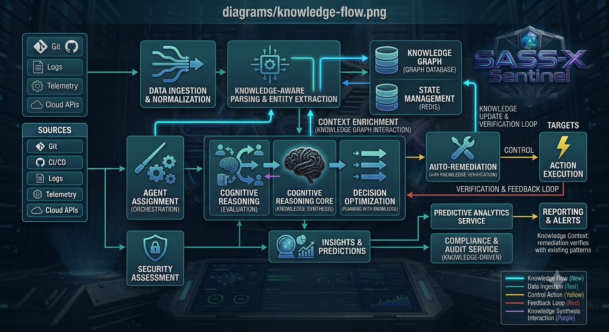

# 🧠 Engineering Knowledge Flow

## Como o conhecimento percorre toda a plataforma SASS-X Sentinel

> *O maior patrimônio de uma organização não é seu código-fonte. É o conhecimento acumulado sobre esse código. O SASS-X Sentinel foi projetado para capturar, organizar, enriquecer e reutilizar esse conhecimento continuamente.*

---

# Dados não geram decisões.

Conhecimento gera decisões.

Uma aplicação produz milhares de informações diariamente.

Commits.

Pull Requests.

Logs.

Eventos.

Deploys.

Alertas.

Métricas.

Traces.

Vulnerabilidades.

Incidentes.

Sozinhos, esses dados possuem pouco valor.

O verdadeiro valor surge quando conseguimos compreender as relações entre eles.

Essa é a função do Sentinel.

Transformar dados dispersos em conhecimento estruturado.

---

# O ciclo do conhecimento

Toda informação percorre exatamente o mesmo ciclo.

```text
                Informação

                     │

                     ▼

             Coleta de Contexto

                     │

                     ▼

             Enriquecimento

                     │

                     ▼

         Especialistas Digitais

                     │

                     ▼

             Correlação

                     │

                     ▼

              Conhecimento

                     │

                     ▼

               Evidências

                     │

                     ▼

             Decisão Técnica

                     │

                     ▼

          Memória Organizacional

                     │

                     └───────────────┐
                                     │
                                     ▼

                        Próxima Execução
```

Cada nova análise melhora todas as próximas.

---

# Fontes de conhecimento

O Sentinel trabalha continuamente com diversas fontes de informação.

```text
Código Fonte

APIs

Banco de Dados

Logs

Tracing

Métricas

Pipelines

Infraestrutura

Pull Requests

Commits

Documentação

Incidentes

Dashboards

Knowledge Base
```

Cada uma representa apenas parte da realidade.

Somadas, elas descrevem o comportamento da aplicação.

---

# A primeira etapa: Contexto

Nenhuma análise começa pelo código.

Ela começa entendendo o contexto.

O Sentinel procura responder perguntas como:

* Qual domínio de negócio está sendo alterado?
* Quais tecnologias participam?
* Existe histórico semelhante?
* Existem incidentes relacionados?
* Existe documentação?
* Há padrões conhecidos?
* Existe conhecimento reutilizável?

Somente depois disso a análise técnica começa.

---

# Enriquecimento

Após compreender o contexto, o Sentinel adiciona novas informações.

Exemplos:

* dependências;
* arquitetura;
* tecnologias;
* histórico;
* decisões anteriores;
* componentes afetados;
* riscos conhecidos.

Essa etapa reduz interpretações isoladas.

---

# Compartilhamento entre especialistas

Todo conhecimento produzido por um especialista fica imediatamente disponível para os demais.

```text
             Especialista Segurança

                       │

                       ▼

              Knowledge Exchange

      ┌────────────┼─────────────┐

      ▼            ▼             ▼

Arquitetura   Performance   Observabilidade

      ▼            ▼             ▼

             Consolidação
```

Nenhum especialista trabalha "às cegas".

---

# Correlação

Após todas as análises, inicia-se uma das etapas mais importantes.

A correlação.

Nesse momento a plataforma identifica relações entre informações aparentemente independentes.

Exemplos:

* uma vulnerabilidade pode explicar um incidente;
* uma decisão arquitetural pode explicar um gargalo;
* um deploy pode justificar aumento de erros;
* uma alteração de banco pode explicar degradação de performance.

O Sentinel conecta essas informações automaticamente.

---

# Construção de conhecimento

Após correlacionar evidências, a plataforma gera conhecimento estruturado.

Exemplo simplificado.

```text
Commit

↓

Novo Endpoint

↓

Sem autenticação

↓

OWASP

↓

API Pública

↓

Dados Sensíveis

↓

Risco Crítico

↓

Roadmap Prioritário
```

<p align="center">
    
</p>

Observe que o resultado não é apenas um alerta.

É uma conclusão contextualizada.

---

# Memória Organizacional

Todo conhecimento relevante pode ser preservado.

A memória da plataforma registra:

* padrões arquiteturais;
* convenções;
* exceções;
* decisões técnicas;
* componentes críticos;
* regras de negócio;
* histórico de execuções.

Essa memória reduz retrabalho.

---

# Knowledge Graph

A memória não é apenas um conjunto de documentos.

Ela representa um grafo de relacionamentos.

```text
Pedido

│

├──── Serviço

│

├──── Banco

│

├──── API

│

├──── Eventos

│

├──── Logs

│

└──── Dashboards
```

Cada elemento conhece suas dependências.

Isso permite compreender impactos antes mesmo da execução das análises.

---

# Cache Inteligente

Nem toda informação precisa ser reconstruída.

O Sentinel verifica continuamente:

* o que mudou;
* o que permanece válido;
* o que pode ser reutilizado.

```text
Execução

↓

Mudou?

↓

Não

↓

Cache

↓

Resultado reutilizado

↓

Economia de tempo
```

Essa estratégia reduz significativamente processamento e consumo de modelos de IA.

---

# Engenharia baseada em contexto

O Sentinel evita recomendações isoladas.

Toda recomendação considera:

* arquitetura;
* histórico;
* impacto;
* domínio de negócio;
* criticidade;
* dependências;
* ambiente.

Duas linhas de código iguais podem gerar recomendações diferentes dependendo do contexto.

---

# Fluxo completo do conhecimento

```text
                  Solicitação

                       │

                       ▼

              Coleta de Contexto

                       ▼

            Enriquecimento

                       ▼

         Knowledge Graph + Cache

                       ▼

      Digital Engineering Specialists

                       ▼

             Knowledge Exchange

                       ▼

              Correlação

                       ▼

             Consolidação

                       ▼

              Priorização

                       ▼

            Relatório Executivo

                       ▼

        Memória Organizacional

                       │

                       └──────────────┐
                                      │
                                      ▼

                           Próxima Execução
```

Esse fluxo representa um ciclo contínuo.

Quanto mais o Sentinel trabalha, mais conhecimento acumula.

Quanto maior o conhecimento, melhores se tornam as próximas decisões.

---

# Conhecimento é um ativo

O Sentinel parte de uma premissa simples.

Código muda diariamente.

Tecnologias evoluem constantemente.

Ferramentas são substituídas.

Mas conhecimento técnico continua sendo o ativo mais valioso de qualquer organização.

A missão da plataforma é preservar, organizar e ampliar esse conhecimento para que equipes possam tomar decisões melhores, mais rápidas e mais seguras.

---

## Próximo capítulo

➡ **07-execution-lifecycle.md**

No próximo capítulo conheceremos o ciclo completo de execução da plataforma, desde a chegada de uma solicitação até a entrega do relatório final, incluindo estados internos, checkpoints, filas, paralelismo, reprocessamento e recuperação de falhas.
