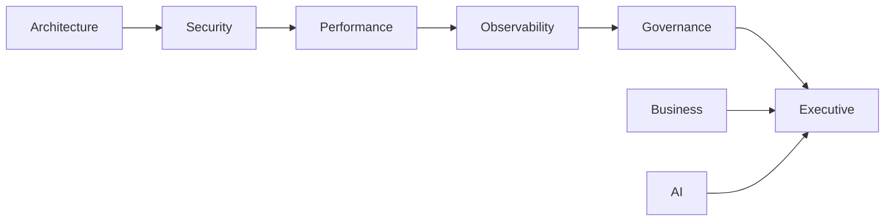

# 🏢 Engineering Domains

## Como o conhecimento da plataforma é organizado

> *Organizações modernas não dependem de um único especialista para tomar todas as decisões. Elas distribuem conhecimento entre equipes altamente especializadas. O SASS-X Sentinel segue exatamente essa filosofia.*

---

# Uma organização digital

O SASS-X Sentinel não foi projetado como uma coleção de agentes independentes.

Ele foi concebido como uma organização de engenharia digital.

Cada domínio representa uma área especializada do conhecimento.

Dentro de cada domínio trabalham especialistas responsáveis por resolver problemas específicos.

Essa estrutura torna a plataforma escalável, modular e preparada para crescer continuamente.

---

# Visão Geral

```text
SASS-X Sentinel

│

├── Executive Office

├── Architecture Office

├── Platform Office

├── Security Office

├── Quality Office

├── Performance Office

├── Cloud Office

├── DevOps Office

├── Observability Office

├── Data Office

├── AI Office

├── Governance Office

└── Business Office
```

Cada domínio possui objetivos próprios, especialistas dedicados e uma forma específica de contribuir para a análise.

---

# Executive Office

Responsável pela coordenação estratégica da plataforma.

Principais responsabilidades:

* coordenação global;
* definição da estratégia de execução;
* gestão das prioridades;
* consolidação dos resultados;
* geração do roadmap.

Principais componentes:

* Chief Engineering Officer
* Engineering Intelligence Center
* Executive Insight Engine

---

# Architecture Office

Responsável pela saúde arquitetural da aplicação.

Exemplos de especialistas:

* Clean Architecture
* Hexagonal Architecture
* DDD
* SOLID
* Design Patterns
* Event Driven Architecture
* Modular Monolith
* Microservices
* API Design
* Technical Debt

Objetivo:

Garantir evolução arquitetural contínua.

---

# Security Office

Responsável pela segurança da plataforma.

Especialistas:

* OWASP
* LGPD
* Secrets Detection
* OAuth
* JWT
* API Security
* Secure Coding
* Cryptography
* Container Security
* Supply Chain Security

Objetivo:

Reduzir riscos antes que cheguem à produção.

---

# Quality Office

Especializado em qualidade de software.

Inclui especialistas em:

* Code Smells
* Complexidade
* Refactoring
* Testabilidade
* Clean Code
* SOLID
* Boas Práticas
* Documentação
* Manutenibilidade

Objetivo:

Aumentar sustentabilidade do código.

---

# Performance Office

Responsável por eficiência computacional.

Analisa:

* memória;
* CPU;
* consultas;
* cache;
* concorrência;
* latência;
* throughput;
* escalabilidade.

Objetivo:

Garantir desempenho consistente.

---

# Cloud Office

Especialistas em plataformas cloud.

Domínios suportados:

* AWS
* Azure
* Google Cloud
* Kubernetes
* Docker
* Serverless
* Service Mesh
* Containers

Objetivo:

Garantir arquitetura cloud saudável.

---

# DevOps Office

Especializado em entrega contínua.

Analisa:

* pipelines;
* GitOps;
* CI/CD;
* automação;
* releases;
* deploys;
* infraestrutura como código.

Objetivo:

Aumentar confiabilidade da entrega.

---

# Observability Office

Responsável pela visibilidade operacional.

Especialistas:

* Logging
* Metrics
* Tracing
* Dashboards
* Alertas
* OpenTelemetry
* APM
* SLI/SLO

Objetivo:

Transformar sistemas observáveis em sistemas compreensíveis.

---

# Data Office

Especialistas em persistência.

Inclui:

* SQL
* PostgreSQL
* Oracle
* SQL Server
* MongoDB
* Redis
* Elastic
* Kafka
* Event Store

Objetivo:

Garantir integridade e desempenho dos dados.

---

# AI Office

Responsável pela inteligência da própria plataforma.

Especialistas:

* Prompt Engineering
* Context Engineering
* RAG
* Knowledge Graph
* Token Optimization
* Cache
* LLM Routing
* Memory Management

Objetivo:

Aumentar eficiência e qualidade das análises.

---

# Governance Office

Especializado em conformidade.

Inclui:

* Auditoria
* Compliance
* LGPD
* Human Approval
* Change Management
* Risk Assessment
* Traceability

Objetivo:

Garantir decisões auditáveis.

---

# Business Office

Especialistas responsáveis pelo entendimento do domínio de negócio.

Analisam:

* regras de negócio;
* processos;
* eventos;
* fluxos;
* impacto operacional;
* criticidade.

Objetivo:

Conectar engenharia ao negócio.

---

# Como os Domínios Colaboram

Nenhum domínio trabalha isoladamente.



Todos compartilham conhecimento continuamente.

---

# Crescimento Contínuo

A arquitetura foi projetada para expansão permanente.

Novos domínios podem ser adicionados sem alterar os existentes.

Exemplos futuros:

* FinOps Office
* Platform Engineering Office
* Data Science Office
* Chaos Engineering Office
* Sustainability Office
* AI Governance Office
* Digital Twin Office

Essa abordagem garante longevidade para a plataforma.

---

# Uma organização viva

Cada domínio evolui independentemente.

Novos especialistas podem surgir.

Outros podem ser substituídos.

Tecnologias mudam.

Ferramentas evoluem.

Mas a organização permanece consistente.

Essa é uma das principais características do SASS-X Sentinel.

Não importa qual tecnologia apareça nos próximos anos.

Sempre haverá um lugar para ela dentro da organização.

---

# Resumo

O Sentinel não organiza funcionalidades.

Ele organiza conhecimento.

Cada domínio representa uma disciplina da Engenharia de Software.

Cada especialista representa anos de experiência concentrados em um único propósito.

O resultado é uma plataforma capaz de crescer continuamente sem perder organização, rastreabilidade ou capacidade de evolução.

---

