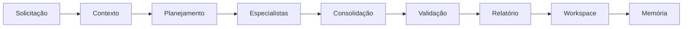
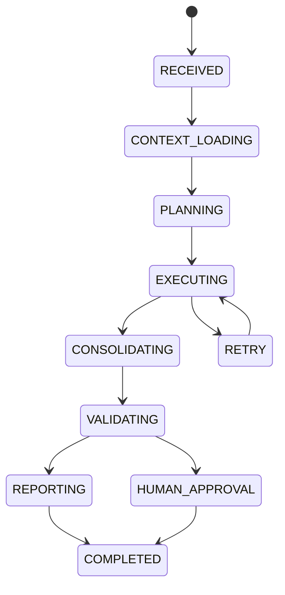
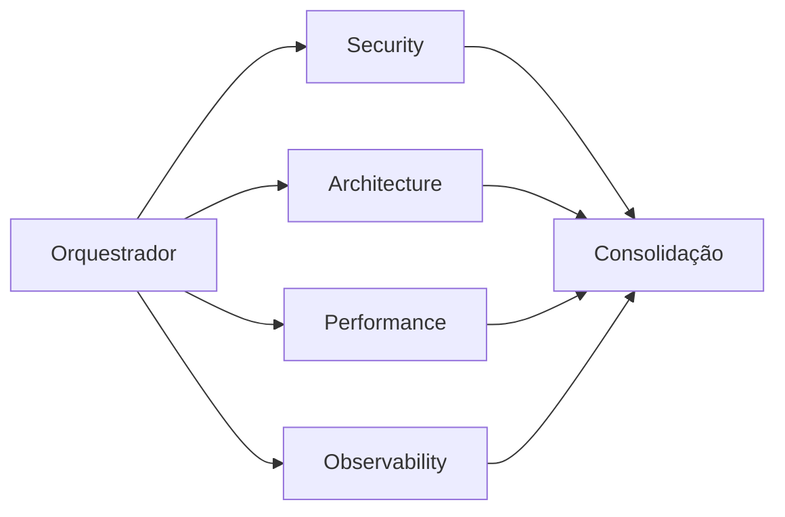
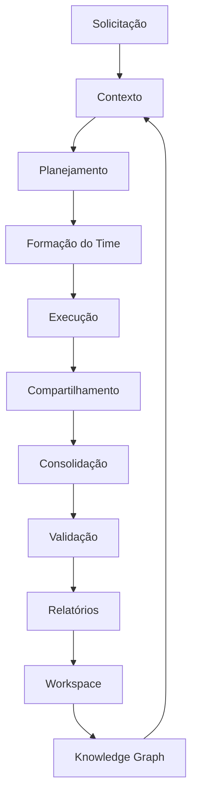

# 🔄 Autonomous Engineering Lifecycle

## O ciclo de vida de uma execução dentro do SASS-X Sentinel

> *Uma execução no SASS-X Sentinel não é apenas uma sequência de chamadas para modelos de IA. É um processo estruturado de Engenharia de Software composto por planejamento, coordenação, análise, consolidação, validação e aprendizado contínuo.*

---

# Visão Geral

Toda solicitação recebida pelo Sentinel percorre um ciclo operacional padronizado.

Independentemente de sua origem — uma Pull Request, um incidente, uma auditoria arquitetural ou uma pergunta em linguagem natural — a plataforma executa as mesmas etapas fundamentais.

Essa padronização garante previsibilidade, rastreabilidade e repetibilidade.



Cada etapa possui objetivos claros e critérios de conclusão bem definidos.

---

# O Estado da Execução

Toda execução possui um ciclo de estados.



Cada estado é registrado para auditoria e recuperação.

---

# Fase 1 — Recepção

A plataforma recebe uma nova solicitação.

Ela pode vir de diferentes canais.

* IDE
* GitHub
* GitLab
* Azure DevOps
* API
* CLI
* MCP
* Interface Web

Nesse momento ainda não existe nenhuma análise.

Existe apenas uma intenção.

---

# Fase 2 — Descoberta de Contexto

Antes de qualquer especialista ser acionado, o Sentinel precisa compreender o cenário.

Perguntas respondidas nesta etapa:

* Qual projeto está sendo analisado?
* Qual tecnologia foi identificada?
* Existe histórico?
* Existem decisões arquiteturais anteriores?
* Existe documentação?
* Existe Workspace relacionado?

Se existir conhecimento anterior, ele será reutilizado.

---

# Fase 3 — Planejamento

Agora a plataforma monta um plano de execução.

Exemplo.

```text
Objetivo

↓

Tecnologias

↓

Especialistas necessários

↓

Prioridades

↓

Dependências

↓

Plano de execução
```

Nem toda solicitação necessita dos mesmos especialistas.

Essa seleção reduz tempo de execução e custo operacional.

---

# Fase 4 — Formação do Time Digital

Neste momento o Orquestrador monta a equipe que participará daquela execução.

Exemplo.

```text
Chief Engineering Officer

│

├── Architecture

├── Security

├── Performance

├── DevOps

├── APIs

├── Cloud

├── Database

└── Observability
```

Cada especialista recebe uma missão específica.

---

# Fase 5 — Execução

Os especialistas iniciam suas análises.

Durante esse processo:

* consultam a memória;
* utilizam cache;
* compartilham contexto;
* registram evidências;
* produzem recomendações.

Nenhum especialista altera código diretamente.

Toda execução é não destrutiva por padrão.

---

# Fase 6 — Compartilhamento de Conhecimento

Os resultados produzidos por um especialista podem influenciar outros especialistas.

Exemplo.

```text
Performance

↓

Banco de Dados

↓

Arquitetura

↓

Observabilidade

↓

Consolidação
```

Essa colaboração evita recomendações contraditórias.

---

# Fase 7 — Consolidação

A plataforma reúne todos os achados.

Nesta etapa ocorre:

* remoção de duplicidades;
* correlação;
* classificação;
* cálculo de prioridade;
* organização do roadmap.

O objetivo não é produzir centenas de alertas.

O objetivo é produzir poucas decisões realmente relevantes.

---

# Fase 8 — Human-in-the-Loop

Toda recomendação crítica permanece sob responsabilidade humana.

O Sentinel apresenta:

* evidências;
* justificativas;
* riscos;
* impacto;
* sugestões.

A decisão continua sendo do engenheiro responsável.

---

# Fase 9 — Relatório Executivo

Após aprovação, a plataforma gera documentação completa.

Entre os artefatos produzidos:

* Sumário Executivo;
* Relatório Técnico;
* Achados;
* Evidências;
* Plano de Evolução;
* Roadmap;
* Before/After;
* Métricas.

Cada relatório recebe identificação única e permanece disponível para auditoria.

---

# Fase 10 — Aprendizado

Uma execução nunca termina apenas produzindo um relatório.

Ela também produz conhecimento.

Esse conhecimento pode alimentar:

* Knowledge Graph;
* cache;
* memória;
* padrões arquiteturais;
* histórico do projeto.

Cada execução melhora a próxima.

---

# Recuperação de Falhas

O Sentinel foi projetado para ambientes corporativos.

Por isso, falhas são tratadas como eventos esperados.

Caso algum especialista apresente problemas, a plataforma pode:

* repetir apenas aquela etapa;
* reaproveitar contexto;
* reutilizar resultados válidos;
* continuar do último checkpoint.

```mermaid
flowchart TD

Erro

-->Checkpoint

Checkpoint

-->Retry

Retry

-->Sucesso

Retry

-->Falha

Falha

-->Relatório Parcial
```

Isso evita reiniciar análises longas.

---

# Checkpoints

Cada fase cria um checkpoint.

Exemplo.

```text
001-context

002-planning

003-specialists

004-findings

005-consolidation

006-report

007-workspace
```

Esses checkpoints permitem pausar e retomar execuções.

---

# Paralelismo Inteligente

Embora o ciclo pareça linear, muitas etapas são executadas em paralelo.

Exemplo.



O paralelismo reduz tempo sem comprometer consistência.

---

# Rastreabilidade Completa

Cada decisão da plataforma pode ser reconstruída.

São registrados:

* quem executou;
* quando executou;
* contexto utilizado;
* especialistas envolvidos;
* evidências;
* decisões tomadas;
* tempo gasto.

Essa rastreabilidade é essencial para ambientes regulados e auditorias.

---

# O Ciclo Completo



Observe que o ciclo nunca termina.

O conhecimento produzido retorna para o início do processo, tornando cada nova execução mais eficiente do que a anterior.

Esse mecanismo de retroalimentação é um dos pilares da arquitetura do SASS-X Sentinel.

---

# Princípios do Ciclo Operacional

Toda execução respeita os seguintes princípios:

* **Contexto antes da análise**: compreender o ambiente antes de emitir conclusões.
* **Especialização**: cada especialista atua apenas em seu domínio.
* **Colaboração**: especialistas compartilham conhecimento continuamente.
* **Evidência**: nenhuma recomendação existe sem justificativa verificável.
* **Rastreabilidade**: toda decisão pode ser reconstruída.
* **Aprendizado contínuo**: cada execução fortalece a memória da plataforma.
* **Supervisão humana**: decisões críticas permanecem sob controle das equipes.

Esses princípios permitem que o Sentinel funcione como uma plataforma de Engenharia de Software Contínua, e não apenas como um mecanismo de automação.

---

## Próximo capítulo

➡ **08-platform-security-and-governance.md**

Conheceremos como o Sentinel trata segurança, governança, auditoria, conformidade, LGPD, controle de acesso, rastreabilidade e o modelo Human-in-the-Loop que garante que a inteligência artificial apoie — e nunca substitua — as decisões de engenharia.
