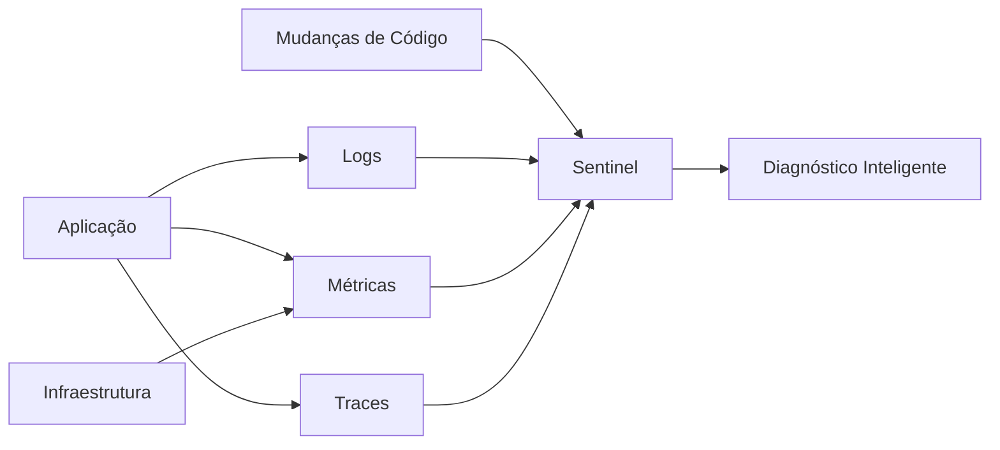
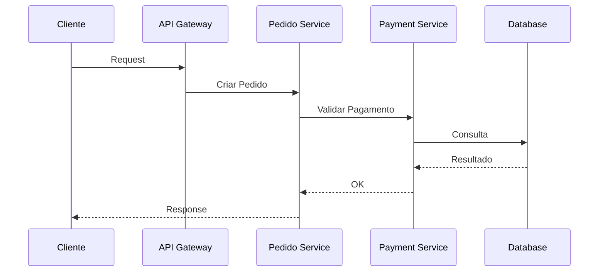
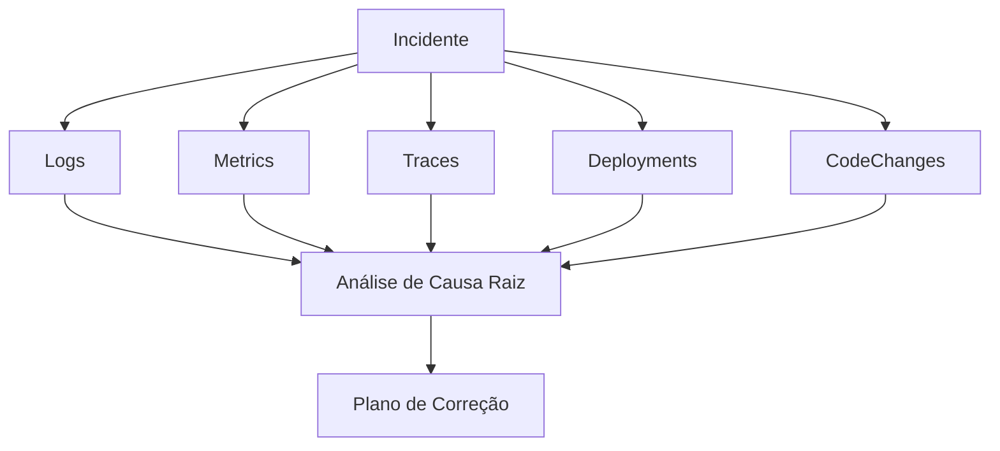
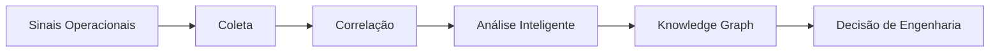
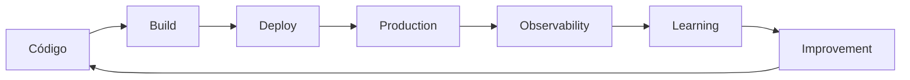

# 📊 Observability Intelligence

## Observabilidade inteligente orientada por Engenharia

> *O SASS-X Sentinel entende que uma aplicação não pode ser avaliada apenas pelo código-fonte. Sistemas modernos precisam ser compreendidos pelo seu comportamento completo: código, arquitetura, infraestrutura, usuários, métricas e eventos em produção.*

---

# Visão Geral

A Engenharia de Software moderna não termina quando o código é entregue.

Um software saudável precisa continuar sendo observado durante todo seu ciclo de vida.

Aplicações corporativas possuem milhares de sinais acontecendo simultaneamente:

* requisições;
* erros;
* logs;
* métricas;
* traces;
* consumo de recursos;
* comportamento dos usuários;
* eventos de infraestrutura;
* alterações de código.

O grande desafio não é coletar dados.

O desafio é transformar esses dados em conhecimento.

---

# O problema da observabilidade tradicional

Empresas possuem excelentes ferramentas de monitoramento.

Exemplos:

* APM;
* ferramentas de logs;
* métricas;
* dashboards;
* alertas;
* tracing distribuído.

Porém, normalmente essas informações vivem separadas.

Um time analisa logs.

Outro analisa infraestrutura.

Outro analisa código.

Outro analisa banco de dados.

Quando ocorre um incidente, inicia-se uma investigação manual.

A pergunta normalmente é:

> "O que aconteceu?"

Mas a pergunta mais importante deveria ser:

> "Por que aconteceu e como evitar novamente?"

---

# A proposta do Sentinel

O SASS-X Sentinel adiciona uma camada inteligente sobre a observabilidade existente.

Ele conecta:



---

# Observabilidade como conhecimento

O Sentinel não trata observabilidade apenas como monitoramento.

Ele interpreta sinais dentro de contexto.

Exemplo:

Um alerta tradicional:

```
CPU acima de 90%
```

mostra apenas um sintoma.

O Sentinel busca responder:

```
Qual serviço apresentou aumento?

Qual mudança aconteceu antes?

Qual componente foi impactado?

Existe relação com deploy recente?

Existe padrão histórico?

Qual correção é recomendada?
```

---

# Os três pilares da observabilidade

O Sentinel trabalha com os principais pilares modernos.

---

# 📄 Logs

Logs representam eventos e acontecimentos.

O Sentinel pode analisar:

* exceções;
* mensagens de erro;
* padrões recorrentes;
* stack traces;
* falhas silenciosas;
* ausência de informações importantes.

Exemplo:

```text
Erro:

Timeout ao chamar Payment API


Sentinel identifica:

- serviço afetado;
- frequência;
- alteração recente;
- ausência de retry;
- ausência de circuit breaker.
```

---

# 📈 Métricas

Métricas representam comportamento quantitativo.

Exemplos:

* CPU;
* memória;
* latência;
* throughput;
* taxa de erro;
* consumo de recursos.

O Sentinel utiliza métricas para identificar:

* degradação;
* tendências;
* anomalias;
* gargalos.

---

# 🔎 Distributed Tracing

Traces permitem visualizar o caminho completo de uma requisição.

Exemplo:



Com tracing, o Sentinel consegue identificar onde uma operação realmente está falhando.

---

# Integração com SRE

O Sentinel utiliza conceitos modernos de Site Reliability Engineering.

Entre eles:

* SLIs;
* SLOs;
* Error Budget;
* Incident Management;
* Postmortems.

---

# Inteligência sobre incidentes

Durante um incidente, o Sentinel pode correlacionar:



---

# Root Cause Analysis inteligente

Um dos principais objetivos do Sentinel é reduzir o tempo de diagnóstico.

Em vez de apenas informar:

```
Serviço indisponível
```

o Sentinel busca produzir:

```
Causa provável:

Novo deploy alterou timeout do serviço Payment.

Impacto:

15% das transações apresentaram falha.

Evidência:

- aumento de latência após release 2.5.0;
- logs com timeout;
- ausência de retry configurado.

Recomendação:

Implementar timeout adaptativo + circuit breaker.
```

---

# Observabilidade preventiva

A plataforma não atua apenas depois do problema.

Ela busca identificar riscos antes do incidente.

Exemplos:

* ausência de logs estruturados;
* falta de correlação distribuída;
* endpoints sem métricas;
* serviços sem health check;
* alto acoplamento;
* dependências críticas.

---

# Integração com ferramentas corporativas

O Sentinel pode atuar junto ao ecossistema existente.

Exemplos:

* New Relic;
* Dynatrace;
* Elastic;
* Grafana;
* Prometheus;
* OpenTelemetry;
* Kubernetes.

O objetivo não é substituir essas ferramentas.

É adicionar inteligência sobre elas.

---

# Fluxo de Observabilidade Inteligente



---

# Observabilidade integrada ao ciclo de software

O Sentinel conecta desenvolvimento e operação.



Cada ciclo gera aprendizado para o próximo.

---

# Benefícios

A camada de Observability Intelligence proporciona:

## Diagnóstico mais rápido

Redução do tempo de investigação.

---

## Menos incidentes repetidos

Conhecimento histórico evita reincidência.

---

## Melhor tomada de decisão

Equipes recebem contexto, não apenas alertas.

---

## Maior confiabilidade

Arquitetura, código e operação trabalham juntos.

---

## Evolução contínua

Cada incidente gera aprendizado.

---

# Visão futura

A evolução da observabilidade caminha para sistemas capazes de interpretar o ambiente.

O futuro não será apenas:

```
Sistema detectou problema.
```

Será:

```
Sistema identificou risco,
entendeu impacto,
encontrou causa provável
e recomendou evolução.
```

---

# Resumo

O SASS-X Sentinel transforma observabilidade tradicional em inteligência operacional.

Ao combinar logs, métricas, traces, contexto arquitetural e conhecimento histórico, a plataforma aproxima desenvolvimento, operações e arquitetura em uma única visão.

A observabilidade deixa de ser apenas monitoramento.

Ela se transforma em conhecimento estratégico para evolução contínua do software.

---

## Próximo capítulo

➡ **10-integrations.md**

No próximo capítulo serão apresentadas as integrações do SASS-X Sentinel com o ecossistema corporativo, incluindo ferramentas DevOps, Cloud, Segurança, Observabilidade, Gestão de Projetos e plataformas de desenvolvimento.
