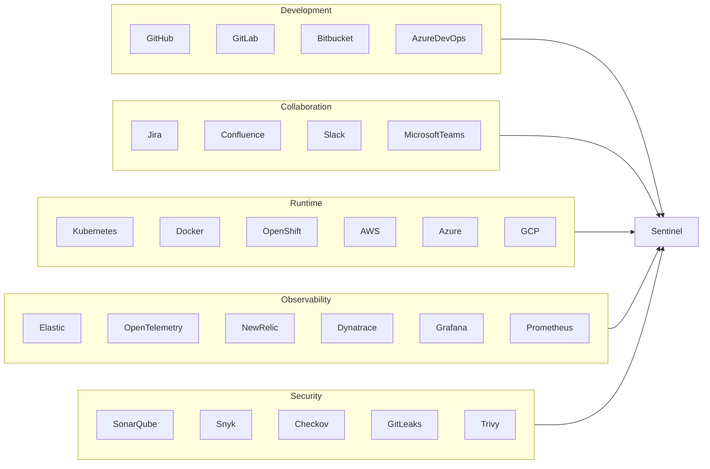
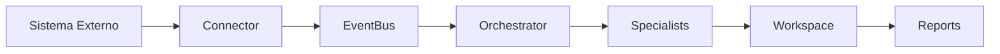

# 🔌 Connected Engineering Ecosystem

## Integrando o SASS-X Sentinel ao ecossistema corporativo

> *O SASS-X Sentinel foi concebido para adaptar-se ao ambiente da organização, preservando processos, ferramentas e fluxos existentes. A plataforma atua como uma camada inteligente de engenharia, conectando informações dispersas e transformando eventos em conhecimento acionável.*

---

# Integração sem ruptura

Empresas já possuem um ecossistema consolidado.

Existem ferramentas para:

* desenvolvimento;
* versionamento;
* observabilidade;
* segurança;
* infraestrutura;
* colaboração;
* gestão de projetos.

O objetivo do Sentinel não é substituir essas soluções.

Seu papel é integrá-las.

A plataforma funciona como uma camada de inteligência sobre o ambiente existente, aproveitando dados produzidos por diferentes sistemas para gerar análises contextualizadas.

---

# Ecossistema Corporativo

O Sentinel centraliza conhecimento sem interferir na operação das ferramentas conectadas.

---

# Categorias de Integração

A arquitetura organiza integrações em grandes categorias.

## Plataformas de Desenvolvimento

Permitem acompanhar o ciclo completo de desenvolvimento.

Exemplos:

* GitHub
* GitLab
* Bitbucket
* Azure DevOps

Essas integrações possibilitam analisar:

* Pull Requests;
* Commits;
* Branches;
* Releases;
* Pipelines.

---

## Gestão de Trabalho

Permitem compreender o contexto do negócio.

Exemplos:

* Jira
* Azure Boards
* Confluence
* Trello

Com essas informações o Sentinel consegue relacionar mudanças de código com requisitos, histórias e incidentes.

---

## Observabilidade

Integrações responsáveis por fornecer visão operacional.

Exemplos:

* OpenTelemetry
* Elastic
* Grafana
* Prometheus
* New Relic
* Dynatrace

Essas fontes permitem correlacionar alterações de código com comportamento em produção.

---

## Segurança

Especializadas na identificação de riscos.

Exemplos:

* SonarQube
* Snyk
* Trivy
* Checkov
* GitLeaks
* OWASP Dependency Check

Essas integrações enriquecem as análises realizadas pelos especialistas digitais.

---

## Cloud & Infraestrutura

Permitem compreender o ambiente onde a aplicação está sendo executada.

Exemplos:

* Kubernetes
* Docker
* AWS
* Azure
* Google Cloud
* Terraform

O Sentinel utiliza essas informações para identificar riscos operacionais, gargalos e oportunidades de otimização.

---

## Comunicação Corporativa

Facilitam a disseminação dos resultados.

Exemplos:

* Slack
* Microsoft Teams
* E-mail
* Webhooks

Os relatórios podem ser distribuídos automaticamente para equipes técnicas e gestores.

---

# Modelo de Conectividade

Todas as integrações seguem um modelo padronizado.

Esse padrão facilita a criação de novos conectores sem alterar o núcleo da plataforma.

---

# Eventos como fonte de conhecimento

O Sentinel trabalha orientado a eventos.

Cada integração pode produzir eventos relevantes, como:

* criação de Pull Request;
* merge;
* deploy;
* rollback;
* falha em pipeline;
* alerta de produção;
* vulnerabilidade detectada;
* incidente registrado.

Esses eventos alimentam continuamente a inteligência da plataforma.

---

# Modelo MCP

Além das integrações tradicionais, o Sentinel foi projetado para trabalhar com o **Model Context Protocol (MCP)**.

Por meio desse padrão, especialistas digitais podem consumir contexto fornecido por diferentes ferramentas e serviços, ampliando sua capacidade de análise sem depender de integrações específicas para cada fornecedor.

Essa abordagem reduz acoplamento e facilita a evolução da plataforma.

---

# APIs Abertas

O Sentinel disponibiliza interfaces para integração com aplicações corporativas.

Essas interfaces permitem:

* iniciar análises;
* consultar execuções;
* recuperar relatórios;
* acompanhar status;
* integrar fluxos automatizados.

A arquitetura orientada a APIs facilita a adoção gradual da plataforma.

---

# Estratégia de Expansão

Novas integrações podem ser incorporadas continuamente.

Cada conector é desenvolvido de forma independente e segue contratos padronizados de entrada e saída.

Essa estratégia garante compatibilidade futura com novas ferramentas sem necessidade de alterar a arquitetura central.

---

# Benefícios para a Organização

Ao conectar-se ao ecossistema corporativo, o Sentinel permite:

* consolidar informações técnicas em um único ponto;
* reduzir tempo de investigação de incidentes;
* relacionar código, infraestrutura e operação;
* enriquecer decisões com contexto organizacional;
* preservar investimentos já realizados em ferramentas existentes;
* acelerar a evolução da engenharia sem substituir processos consolidados.

---

# Princípios de Integração

Todas as integrações seguem os mesmos princípios:

* **Não invasivas**: preservam o funcionamento das ferramentas existentes.
* **Orientadas a eventos**: reagem a mudanças relevantes do ciclo de desenvolvimento.
* **Modulares**: novos conectores podem ser adicionados sem impacto nos demais.
* **Observáveis**: cada interação é registrada para auditoria e rastreabilidade.
* **Seguras**: autenticação, autorização e proteção de dados são tratadas como requisitos fundamentais.

---

# Resumo

O SASS-X Sentinel não pretende substituir o ecossistema tecnológico da organização.

Sua missão é conectar pessoas, processos e plataformas, transformando informações distribuídas em conhecimento centralizado para apoiar decisões de engenharia.

Quanto mais integrado estiver ao ambiente corporativo, maior será sua capacidade de gerar análises contextualizadas e recomendações de alto valor.

---

## Próximo capítulo

➡ **11-enterprise-capabilities.md**

No próximo capítulo conheceremos o Catálogo de Especialistas Digitais, organizado por domínios de engenharia, tecnologias e capacidades, mostrando como a plataforma pode evoluir continuamente com novos especialistas sem alterar sua arquitetura principal.
