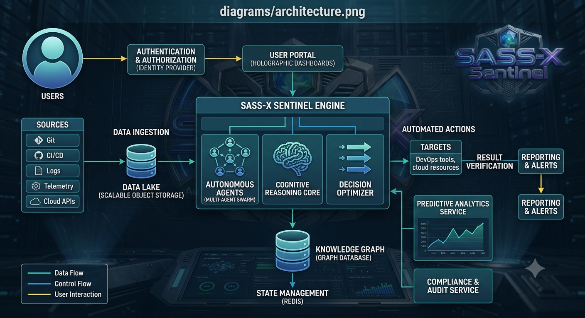

# 📚 Engineering Capability Catalog

## O catálogo de capacidades do SASS-X Sentinel

> *O verdadeiro valor do SASS-X Sentinel não está na quantidade de especialistas digitais que possui, mas na diversidade de capacidades que consegue oferecer às equipes de engenharia.*

<p align="center">
    
</p>

---

# Muito além de uma lista de especialistas

O Sentinel não organiza seus componentes pelo nome dos arquivos ou pela tecnologia utilizada.

Sua organização é baseada em **capacidades de engenharia**.

Cada capacidade representa um conjunto de conhecimentos especializados voltados para resolver um determinado tipo de problema.

Essa abordagem torna a plataforma mais estável, mais fácil de evoluir e muito mais compreensível para organizações de qualquer porte.

---

# Estrutura do Catálogo

```text
Engineering Capability

│

├── Domínio

├── Especialistas

├── Tecnologias

├── Casos de Uso

├── Evidências Produzidas

├── Recomendações

└── Indicadores
```

Cada capacidade pode ser implementada por um ou vários especialistas digitais.

---

# Grandes Capacidades da Plataforma

O catálogo é organizado em grandes áreas da Engenharia de Software.

```text
Architecture

Application Security

Software Quality

Performance Engineering

Cloud Engineering

DevOps Engineering

Platform Engineering

Observability

Data Engineering

API Engineering

Business Analysis

AI Engineering

Governance
```

Cada domínio reúne capacidades relacionadas ao mesmo contexto técnico.

---

# Exemplo de Capacidade

## Application Security

### Objetivo

Identificar vulnerabilidades que possam comprometer a segurança da aplicação.

### Especialistas

* OWASP Analysis
* Secrets Detection
* OAuth Validation
* JWT Analysis
* Secure Coding
* Dependency Analysis
* Container Security
* API Security

### Entradas

* Código-fonte
* Dependências
* Configurações
* Containers
* APIs

### Saídas

* Vulnerabilidades
* Evidências
* Correções
* Priorização
* Before/After

---

# Exemplo de Capacidade

## Software Quality

Objetivo:

Avaliar continuamente a qualidade estrutural da aplicação.

Especialistas envolvidos:

* Clean Code
* SOLID
* Refactoring
* Complexidade
* Code Smells
* Duplicação
* Testabilidade
* Documentação

Resultados esperados:

* melhoria de legibilidade;
* redução de dívida técnica;
* aumento da manutenibilidade;
* recomendações arquiteturais.

---

# Exemplo de Capacidade

## Performance Engineering

Especialistas:

* JVM
* Banco de Dados
* Cache
* Concorrência
* Threads
* SQL
* Garbage Collection
* APIs

Objetivo:

Encontrar gargalos antes que afetem produção.

---

# Exemplo de Capacidade

## Observability

Especialistas:

* Logs
* Tracing
* Metrics
* Dashboards
* Alertas
* OpenTelemetry
* APM

Objetivo:

Melhorar a capacidade de compreender o comportamento dos sistemas em produção.

---

# Exemplo de Capacidade

## DevOps Engineering

Especialistas:

* CI
* CD
* GitOps
* Pipelines
* Releases
* Deploy
* Infrastructure as Code

Objetivo:

Aumentar a confiabilidade da entrega contínua.

---

# Exemplo de Capacidade

## Cloud Engineering

Especialistas:

* AWS
* Azure
* Google Cloud
* Kubernetes
* Docker
* Service Mesh
* Serverless

Objetivo:

Garantir arquiteturas cloud resilientes e eficientes.

---

# Modelo de Capacidade

Toda capacidade segue a mesma estrutura.

```text
Nome

↓

Objetivo

↓

Problemas Resolvidos

↓

Especialistas

↓

Entradas

↓

Processamento

↓

Saídas

↓

Indicadores

↓

Roadmap
```

Essa padronização facilita evolução e manutenção do catálogo.

---

# Classificação de Maturidade

Cada capacidade possui um nível de maturidade.

| Nível        | Descrição                 |
| ------------ | ------------------------- |
| Experimental | Em desenvolvimento        |
| Beta         | Disponível para validação |
| Estável      | Uso recomendado           |
| Enterprise   | Produção em larga escala  |

Essa classificação ajuda equipes a compreenderem o estágio de evolução da plataforma.

---

# Indicadores por Capacidade

Cada domínio pode produzir indicadores específicos.

Exemplos:

**Application Security**

* vulnerabilidades críticas;
* dependências inseguras;
* cobertura de análise.

**Performance**

* tempo médio de resposta;
* gargalos encontrados;
* consultas otimizadas.

**Quality**

* dívida técnica;
* complexidade;
* duplicação.

Esses indicadores alimentam dashboards executivos e relatórios técnicos.

---

# Evolução Contínua

O catálogo foi projetado para crescer continuamente.

Novas capacidades podem ser adicionadas sem alterar as existentes.

Da mesma forma, novos especialistas podem ser incorporados a uma capacidade já existente conforme surgem novas tecnologias ou práticas de engenharia.

Essa arquitetura garante escalabilidade e longevidade.

---

# Como escolher especialistas

O usuário nunca precisa selecionar especialistas manualmente.

Ao receber uma solicitação, o Orquestrador identifica quais capacidades são necessárias e monta automaticamente a equipe mais adequada para aquela execução.

Esse processo considera:

* contexto da solicitação;
* tecnologias identificadas;
* histórico do projeto;
* conhecimento disponível;
* objetivos da análise.

---

# Benefícios do Catálogo

A organização por capacidades oferece diversas vantagens:

* reduz complexidade para o usuário;
* facilita expansão da plataforma;
* evita duplicidade de especialistas;
* promove reutilização de conhecimento;
* simplifica manutenção da documentação;
* aproxima a arquitetura da estrutura de organizações reais de engenharia.

---

# Resumo

O Engineering Capability Catalog representa o mapa de competências do SASS-X Sentinel.

Mais do que listar especialistas, ele demonstra quais problemas a plataforma é capaz de resolver, como essas capacidades evoluem ao longo do tempo e de que forma colaboram para apoiar decisões de engenharia.

Essa visão permite que organizações compreendam rapidamente o alcance da plataforma e identifiquem como ela pode agregar valor aos seus processos de desenvolvimento.

---

## Próximo capítulo

➡ **12-business-use-cases.md**

No próximo capítulo conheceremos os modelos de implantação do SASS-X Sentinel, explorando cenários locais, corporativos, híbridos e em nuvem, além das estratégias de escalabilidade, isolamento e operação em ambientes enterprise.
