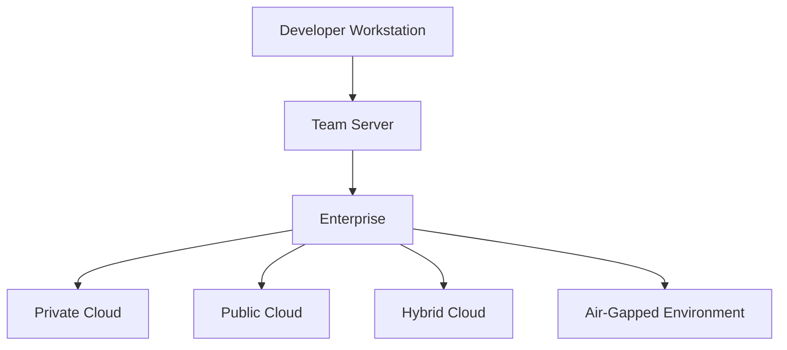
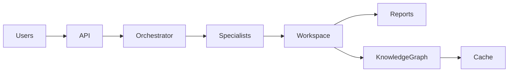

# 🚀 Enterprise Deployment Architecture

## Modelos de implantação do SASS-X Sentinel

> *Cada organização possui necessidades diferentes de segurança, infraestrutura, conformidade e escala. O SASS-X Sentinel foi projetado para adaptar-se a diferentes cenários de implantação, desde ambientes locais até grandes ecossistemas corporativos distribuídos.*

---

# Uma plataforma preparada para crescer

A arquitetura do Sentinel desacopla completamente sua lógica de engenharia da infraestrutura onde é executado.

Isso permite que a plataforma seja implantada em diferentes modelos operacionais sem alterar seu núcleo funcional.

A organização pode iniciar com uma instalação simples para um único desenvolvedor e evoluir gradualmente para um ambiente corporativo distribuído, preservando investimentos e reduzindo riscos.

---

# Visão Geral dos Modelos

Todos os modelos compartilham os mesmos princípios arquiteturais.

---

# Modelo 1 — Developer Workstation

Destinado ao uso individual.

Ideal para:

* desenvolvedores;
* arquitetos;
* consultores;
* estudos;
* provas de conceito.

Características:

* instalação local;
* execução em CLI;
* integração com IDEs;
* geração local de relatórios;
* baixo consumo de infraestrutura.

Esse modelo permite validar rapidamente a plataforma antes de expandi-la para equipes maiores.

---

# Modelo 2 — Team Server

Voltado para pequenas e médias equipes.

Características:

* workspace compartilhado;
* especialistas centralizados;
* relatórios unificados;
* integração com Git;
* pipelines de CI/CD.

Benefícios:

* padronização das análises;
* compartilhamento de conhecimento;
* redução de retrabalho entre equipes.

---

# Modelo 3 — Enterprise Platform

Indicado para organizações com múltiplos times e projetos.

Capacidades adicionais:

* múltiplos workspaces;
* segregação por equipes;
* controle de acesso;
* auditoria centralizada;
* governança corporativa;
* dashboards executivos.

Nesse cenário, o Sentinel torna-se uma plataforma organizacional de engenharia.

---

# Modelo 4 — Private Cloud

Implantação em infraestrutura privada da organização.

Indicado para ambientes com requisitos elevados de segurança.

Exemplos:

* Kubernetes corporativo;
* OpenShift;
* VMware;
* datacenters próprios.

Todo o processamento permanece sob domínio da organização.

---

# Modelo 5 — Public Cloud

Implantação em provedores de nuvem pública.

Ambientes suportados:

* AWS;
* Microsoft Azure;
* Google Cloud Platform.

Benefícios:

* escalabilidade elástica;
* alta disponibilidade;
* integração com serviços gerenciados;
* expansão simplificada.

---

# Modelo 6 — Hybrid Cloud

Combina infraestrutura local e serviços em nuvem.

Exemplos de uso:

* código-fonte permanece on-premises;
* processamento distribuído;
* dashboards hospedados em nuvem;
* integração com serviços externos.

Essa arquitetura permite equilibrar desempenho, segurança e flexibilidade.

---

# Modelo 7 — Air-Gapped Environment

Projetado para ambientes isolados da Internet.

Aplicável a organizações como:

* instituições financeiras;
* órgãos governamentais;
* indústria de defesa;
* infraestrutura crítica.

Características:

* operação totalmente offline;
* integração com modelos locais;
* armazenamento interno;
* nenhuma dependência de serviços externos.

---

# Arquitetura Lógica

Independentemente do modelo adotado, os componentes principais permanecem os mesmos.

Essa consistência reduz a complexidade operacional e facilita migrações entre ambientes.

---

# Escalabilidade

Cada componente da plataforma pode evoluir de forma independente.

Exemplos:

* múltiplos orquestradores;
* especialistas distribuídos;
* cache compartilhado;
* workspaces independentes;
* múltiplas filas de processamento.

Essa arquitetura permite escalar horizontalmente conforme a demanda cresce.

---

# Alta Disponibilidade

Em ambientes corporativos, diferentes componentes podem operar em redundância.

Entre eles:

* API Gateway;
* Orquestradores;
* Filas;
* Workspace;
* Banco de Conhecimento.

Essa estratégia reduz pontos únicos de falha e aumenta a continuidade operacional.

---

# Segurança da Implantação

A arquitetura considera segurança como requisito transversal.

Boas práticas incluem:

* autenticação centralizada;
* criptografia em trânsito e em repouso;
* segregação por equipes;
* auditoria completa;
* gerenciamento de segredos;
* controle de permissões baseado em papéis.

Esses mecanismos permitem que a plataforma atenda ambientes regulados e de alta criticidade.

---

# Observabilidade Operacional

Independentemente do ambiente, o Sentinel registra continuamente:

* eventos;
* métricas;
* tempos de execução;
* utilização de especialistas;
* falhas;
* consumo de recursos.

Essas informações alimentam dashboards operacionais e executivos.

---

# Evolução Gradual

Um dos princípios do Sentinel é permitir adoção incremental.

Uma organização pode iniciar com um único desenvolvedor e evoluir, conforme sua maturidade, para uma plataforma corporativa distribuída.

Esse modelo reduz barreiras de adoção e permite que o investimento acompanhe o crescimento da organização.

---

# Benefícios

Os diferentes modelos de implantação proporcionam:

* flexibilidade arquitetural;
* adaptação ao ambiente existente;
* escalabilidade progressiva;
* conformidade com requisitos corporativos;
* preservação de investimentos;
* facilidade de expansão.

---

# Resumo

O SASS-X Sentinel foi projetado para ser uma plataforma de Engenharia de Software Autônoma adaptável a diferentes realidades organizacionais.

Sua arquitetura desacoplada permite evoluir de instalações individuais para grandes ambientes corporativos sem necessidade de reescrever componentes ou alterar a forma como a plataforma opera.

Independentemente do cenário escolhido, os princípios de especialização, colaboração, rastreabilidade e aprendizado contínuo permanecem os mesmos.

---

## Próximo capítulo

➡ **13-platform-roadmap.md**

No próximo capítulo conheceremos o roadmap estratégico da plataforma, apresentando a visão de evolução do SASS-X Sentinel, seus pilares tecnológicos, capacidades planejadas e a direção arquitetural para os próximos ciclos de desenvolvimento.
