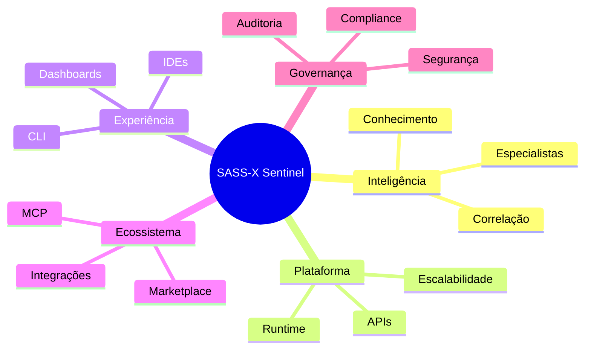

# 🗺️ Platform Evolution Strategy

## A visão de longo prazo do SASS-X Sentinel

> *O SASS-X Sentinel não é um projeto concluído. É uma plataforma em evolução contínua, construída para acompanhar as transformações da Engenharia de Software, da Inteligência Artificial e da Computação em Nuvem.*

    

---

# Nossa Visão

Acreditamos que o futuro da Engenharia de Software será colaborativo.

Equipes humanas continuarão sendo responsáveis pelas decisões estratégicas, enquanto plataformas inteligentes assumirão atividades repetitivas, análises complexas e consolidação de conhecimento.

O SASS-X Sentinel existe para acelerar essa transformação, atuando como um parceiro permanente das equipes de engenharia.

---

# Princípios da Evolução

Toda evolução da plataforma respeita os seguintes princípios:

* Compatibilidade com versões anteriores sempre que possível.
* Evolução incremental em pequenos ciclos.
* Arquitetura modular e extensível.
* Segurança como requisito transversal.
* Observabilidade por padrão.
* Inteligência baseada em evidências.
* Decisão humana como etapa obrigatória para ações críticas.

Esses princípios orientam todas as decisões arquiteturais da plataforma.

---

# Horizontes de Evolução

A evolução do Sentinel está organizada em três horizontes estratégicos.

## Horizonte 1 — Consolidação

Objetivo:

Fortalecer o núcleo da plataforma.

Prioridades:

* estabilidade operacional;
* ampliação do catálogo de capacidades;
* melhoria da experiência do usuário;
* expansão das integrações;
* otimização do consumo de recursos.

---

## Horizonte 2 — Expansão

Objetivo:

Transformar o Sentinel em uma plataforma corporativa de engenharia.

Capacidades previstas:

* novos domínios especializados;
* inteligência distribuída;
* dashboards executivos;
* colaboração entre equipes;
* análises organizacionais;
* indicadores estratégicos.

---

## Horizonte 3 — Engenharia Autônoma

Objetivo:

Permitir que a plataforma participe ativamente da evolução do software.

Exemplos de capacidades:

* recomendações arquiteturais contínuas;
* geração assistida de planos de modernização;
* simulação de impacto antes de mudanças;
* análise preditiva de riscos;
* otimização contínua baseada em histórico.

Mesmo nesse horizonte, decisões críticas permanecem sob supervisão humana.

---

# Pilares Estratégicos

A evolução da plataforma concentra-se em cinco pilares.

Cada novo recurso deve fortalecer pelo menos um desses pilares.

---

# Linhas de Evolução

## Inteligência

* ampliação do Knowledge Graph;
* evolução da memória organizacional;
* melhor roteamento de especialistas;
* otimização do uso de modelos de IA.

---

## Plataforma

* escalabilidade horizontal;
* novos conectores;
* maior resiliência;
* otimização do runtime.

---

## Engenharia

* novas capacidades técnicas;
* ampliação do catálogo de especialistas;
* suporte a novas linguagens;
* suporte a novos frameworks.

---

## Ecossistema

* expansão das integrações corporativas;
* novos protocolos de comunicação;
* automação de fluxos de engenharia.

---

## Governança

* novas políticas de auditoria;
* gestão de riscos;
* controles de conformidade;
* evolução do modelo Human-in-the-Loop.

---

# O que NÃO faz parte da visão

Algumas decisões são intencionais.

O Sentinel não pretende:

* substituir equipes de engenharia;
* realizar alterações críticas sem aprovação humana;
* tornar-se dependente de um único modelo de IA;
* limitar-se a uma única linguagem ou provedor de nuvem.

A plataforma foi concebida para ser aberta, modular e interoperável.

---

# Medindo a Evolução

O progresso da plataforma não será medido apenas pela quantidade de funcionalidades.

Os principais indicadores incluem:

* novas capacidades adicionadas;
* cobertura tecnológica;
* qualidade das recomendações;
* tempo médio de análise;
* reutilização de conhecimento;
* redução de retrabalho;
* satisfação das equipes.

Esses indicadores refletem o valor entregue, e não apenas o volume de código produzido.

---

# Compromisso com a Comunidade

O crescimento do Sentinel depende da colaboração entre profissionais de diferentes áreas.

Arquitetos, desenvolvedores, especialistas em segurança, observabilidade, DevOps, qualidade e plataforma podem contribuir com novas capacidades, integrações e melhorias.

A arquitetura modular foi concebida para facilitar essa colaboração.

---

# Uma Plataforma para a Próxima Década

A Engenharia de Software continuará evoluindo.

Novas linguagens surgirão.

Novos modelos de IA serão criados.

Ferramentas serão substituídas.

O objetivo do SASS-X Sentinel é permanecer relevante independentemente dessas mudanças, preservando sua arquitetura, seus princípios e sua missão.

Mais do que acompanhar tendências, a plataforma busca criar uma base sólida para a engenharia contínua dos próximos anos.

---

# Resumo

O SASS-X Sentinel é uma plataforma em constante evolução.

Seu crescimento será guiado por princípios arquiteturais, necessidades reais das organizações e colaboração da comunidade técnica.

Cada nova capacidade incorporada fortalecerá a missão central da plataforma: transformar conhecimento técnico em decisões de engenharia mais rápidas, mais seguras e mais inteligentes.

---

## Próximo capítulo

➡ **14-evolution-roadmap.md**

O próximo capítulo apresenta o modelo de contribuição da plataforma, explicando como novos especialistas, conectores, capacidades e melhorias podem ser desenvolvidos mantendo a consistência arquitetural do SASS-X Sentinel.
