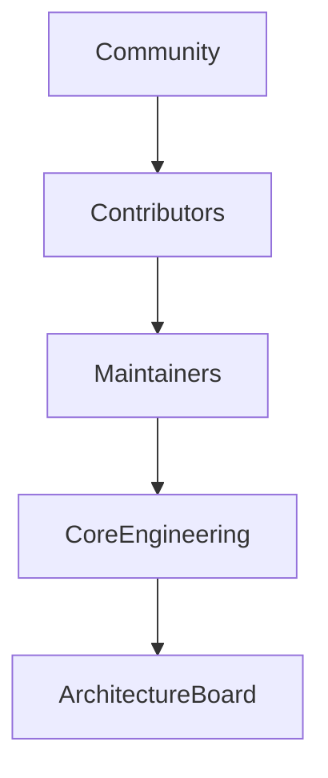
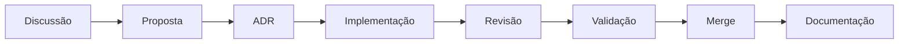

# 🤝 Engineering Contribution Guide

## Como contribuir com a evolução do SASS-X Sentinel

> *O SASS-X Sentinel é uma plataforma construída para evoluir continuamente. Essa evolução acontece por meio da colaboração entre profissionais de diferentes áreas da Engenharia de Software, cada um contribuindo com conhecimento especializado para fortalecer o ecossistema da plataforma.*

---

# Contribuir é ampliar conhecimento

Contribuir com o Sentinel vai muito além de escrever código.

A plataforma valoriza diferentes formas de colaboração, incluindo:

* desenvolvimento de novas capacidades;
* criação de especialistas digitais;
* integração com novas ferramentas;
* melhoria da documentação;
* evolução arquitetural;
* otimização de desempenho;
* revisão técnica;
* compartilhamento de boas práticas.

Cada contribuição fortalece o conhecimento coletivo da plataforma.

---

# Modelo de Governança

A evolução do projeto segue um modelo colaborativo.

Cada nível possui responsabilidades específicas.

---

# Community

Toda pessoa interessada pode participar da comunidade.

Formas de colaboração:

* reportar problemas;
* sugerir melhorias;
* abrir discussões;
* testar funcionalidades;
* compartilhar experiências;
* melhorar documentação.

Esse é o ponto de entrada para novos colaboradores.

---

# Contributors

Contributors participam ativamente do desenvolvimento.

Podem contribuir com:

* correção de bugs;
* novos especialistas;
* novos conectores;
* documentação;
* testes;
* melhorias de desempenho.

Todas as contribuições passam por revisão técnica.

---

# Maintainers

Os Maintainers garantem a qualidade da plataforma.

Responsabilidades:

* revisão de Pull Requests;
* validação arquitetural;
* aprovação de mudanças;
* suporte à comunidade;
* manutenção dos módulos.

---

# Core Engineering

Responsável pela evolução técnica da plataforma.

Atua em temas como:

* arquitetura;
* runtime;
* orquestração;
* Knowledge Graph;
* Workspace;
* contratos internos;
* interoperabilidade.

Mudanças estruturais são discutidas coletivamente.

---

# Architecture Board

O Architecture Board preserva a visão de longo prazo da plataforma.

Entre suas responsabilidades:

* avaliar decisões arquiteturais;
* aprovar mudanças estruturais;
* definir padrões;
* revisar ADRs;
* orientar a evolução da plataforma.

Seu objetivo é manter a coerência arquitetural ao longo do tempo.

---

# Formas de Contribuição

A plataforma aceita diferentes tipos de contribuição.

## Novas Capacidades

Exemplos:

* novas análises;
* novos domínios;
* novas recomendações.

---

## Especialistas Digitais

Novos especialistas podem ampliar capacidades existentes ou criar novas áreas de conhecimento.

Todo especialista deve:

* possuir missão clara;
* respeitar contratos padronizados;
* produzir evidências verificáveis;
* colaborar com outros especialistas.

---

## Conectores

Integrações com ferramentas corporativas são altamente incentivadas.

Exemplos:

* plataformas DevOps;
* observabilidade;
* segurança;
* gerenciamento de projetos;
* infraestrutura.

Todos os conectores seguem contratos padronizados.

---

## Documentação

A documentação é considerada parte do produto.

Contribuições podem incluir:

* novos guias;
* diagramas;
* exemplos;
* melhorias didáticas;
* traduções.

---

# Processo de Evolução

Toda mudança significativa segue um fluxo estruturado.

Isso garante rastreabilidade e transparência.

---

# Architecture Decision Records (ADR)

Mudanças arquiteturais relevantes devem ser registradas por meio de ADRs.

Cada ADR documenta:

* contexto;
* problema;
* alternativas avaliadas;
* decisão adotada;
* consequências.

Essa prática preserva o histórico das decisões da plataforma.

---

# Critérios de Qualidade

Antes de uma contribuição ser incorporada, ela deve atender aos seguintes critérios:

* documentação atualizada;
* testes automatizados;
* aderência aos padrões arquiteturais;
* compatibilidade com contratos existentes;
* evidências de funcionamento.

A qualidade da plataforma é responsabilidade compartilhada.

---

# Princípios da Comunidade

Toda colaboração deve respeitar alguns princípios fundamentais:

* respeito às pessoas;
* colaboração aberta;
* aprendizado contínuo;
* transparência;
* diversidade de ideias;
* foco na qualidade.

Esses princípios orientam a convivência entre todos os participantes.

---

# Reconhecimento

Toda contribuição relevante é reconhecida.

Contribuidores podem evoluir naturalmente para novos papéis dentro da comunidade conforme demonstram comprometimento técnico, colaboração e alinhamento com a visão da plataforma.

O crescimento da comunidade depende da participação ativa de seus membros.

---

# Resumo

O SASS-X Sentinel acredita que plataformas sólidas são construídas coletivamente.

Ao estruturar um modelo claro de colaboração, a plataforma busca incentivar a participação da comunidade sem abrir mão da qualidade arquitetural, da consistência técnica e da visão de longo prazo.

Cada contribuição representa uma oportunidade de fortalecer não apenas o código, mas também o conhecimento compartilhado que impulsiona toda a Engenharia de Software Autônoma.

---

## Próximo capítulo

➡ **15-community-and-contribution.md**

No próximo capítulo apresentaremos a Arquitetura de Referência do SASS-X Sentinel, consolidando todos os conceitos apresentados anteriormente em uma visão unificada da plataforma, incluindo seus componentes, fluxos, domínios, integrações e princípios arquiteturais.
