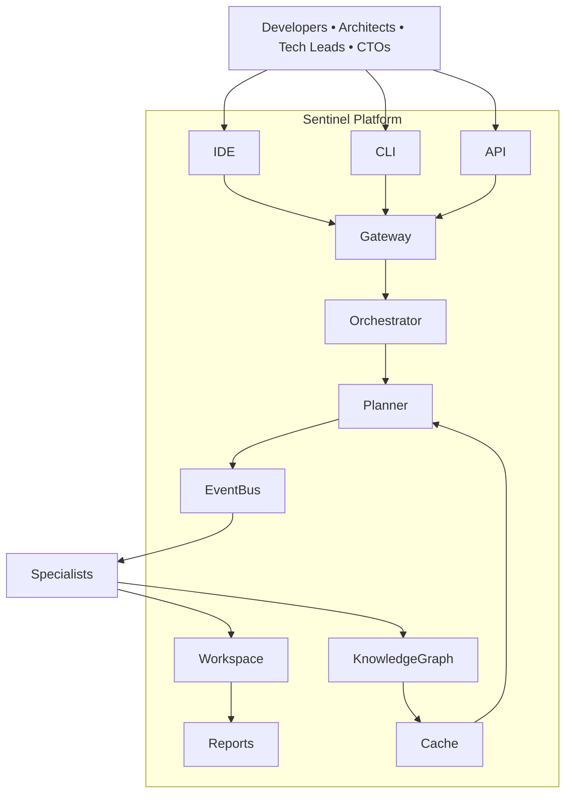
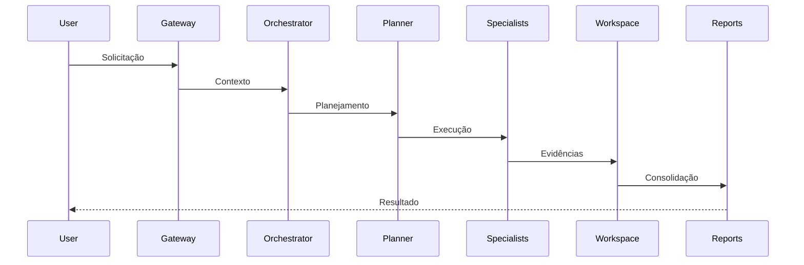
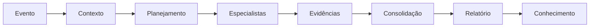
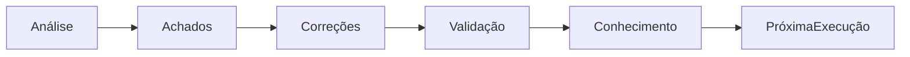

# 🏛 Reference Architecture

## A arquitetura de referência do SASS-X Sentinel

> *A Arquitetura de Referência representa a visão canônica do SASS-X Sentinel. Ela descreve os componentes fundamentais da plataforma, seus relacionamentos, os fluxos de informação e os princípios arquiteturais que orientam sua evolução.*

---

# Visão Geral

O SASS-X Sentinel é uma plataforma distribuída de Engenharia de Software Autônoma.

Sua arquitetura foi concebida para:

* operar de forma modular;
* evoluir continuamente;
* integrar diferentes ecossistemas;
* preservar rastreabilidade;
* transformar eventos em conhecimento.

Cada componente possui responsabilidades bem definidas e comunica-se por contratos padronizados.

---

# Arquitetura Completa

A arquitetura organiza responsabilidades de forma desacoplada, permitindo evolução independente dos componentes.

---

# Camadas Arquiteturais

A plataforma está organizada em camadas complementares.

## Experiência

Responsável pelos pontos de interação.

Inclui:

* CLI;
* IDEs;
* APIs;
* Dashboards.

---

## Entrada

Recebe solicitações e valida contexto.

Componentes:

* Gateway;
* API;
* Autenticação;
* Controle de acesso.

---

## Inteligência

Representa o núcleo da plataforma.

Inclui:

* Orquestrador;
* Planejador;
* Especialistas;
* Knowledge Graph;
* Cache;
* Memória.

É nessa camada que ocorre o processamento inteligente.

---

## Persistência

Responsável pelo armazenamento dos artefatos produzidos.

Componentes:

* Workspace;
* Relatórios;
* Diário de execução;
* Evidências.

---

## Integração

Responsável pela comunicação com sistemas externos.

Exemplos:

* GitHub;
* GitLab;
* Azure DevOps;
* Jira;
* Kubernetes;
* Elastic;
* OpenTelemetry.

---

# Fluxo Arquitetural

Todo processamento segue esse fluxo lógico.

---

# Componentes Principais

## Gateway

Responsável por receber solicitações, autenticar usuários e encaminhar demandas ao Orquestrador.

---

## Orchestrator

Coordena toda a execução.

Suas responsabilidades incluem:

* selecionar especialistas;
* controlar ciclos;
* distribuir tarefas;
* consolidar resultados.

---

## Planner

Traduz objetivos em planos de execução.

Define:

* quais capacidades utilizar;
* ordem de execução;
* dependências;
* estratégia de processamento.

---

## Specialists

São especialistas digitais responsáveis pela execução das análises.

Cada especialista possui:

* missão;
* entradas;
* saídas;
* contratos;
* indicadores.

---

## Knowledge Graph

Representa a memória organizacional da plataforma.

Armazena:

* padrões;
* decisões;
* aprendizados;
* relações entre tecnologias;
* histórico de conhecimento.

---

## Workspace

Espaço de trabalho utilizado durante cada execução.

Contém:

* evidências;
* checkpoints;
* relatórios;
* diário;
* artefatos temporários.

Cada execução possui seu próprio Workspace.

---

## Reports

Transformam conhecimento técnico em informação compreensível para diferentes públicos.

São produzidos em diferentes níveis:

* técnico;
* executivo;
* operacional.

---

# Princípios Arquiteturais

Toda a arquitetura segue princípios bem definidos.

## Modularidade

Cada componente pode evoluir independentemente.

---

## Especialização

Cada especialista resolve um conjunto específico de problemas.

---

## Evidência

Toda conclusão deve ser sustentada por evidências verificáveis.

---

## Human-in-the-Loop

Decisões críticas permanecem sob responsabilidade humana.

---

## Escalabilidade

Todos os componentes podem crescer horizontalmente.

---

## Observabilidade

Cada etapa da plataforma gera eventos e métricas.

---

# Fluxo de Dados

Cada execução produz novos conhecimentos reutilizáveis.

---

# Ciclo de Aprendizado

O Sentinel aprende continuamente a partir das execuções anteriores.

---

# Segurança Arquitetural

A plataforma incorpora segurança em todas as camadas.

Entre os principais mecanismos:

* autenticação;
* autorização;
* auditoria;
* rastreabilidade;
* criptografia;
* segregação de responsabilidades.

Segurança não é um componente isolado, mas um princípio arquitetural transversal.

---

# Escalabilidade

Cada módulo pode ser replicado conforme a necessidade.

Exemplos:

* múltiplos orquestradores;
* especialistas distribuídos;
* múltiplos workspaces;
* cache compartilhado;
* filas independentes.

Isso permite atender desde pequenas equipes até grandes organizações.

---

# Benefícios

A Arquitetura de Referência proporciona:

* clareza organizacional;
* alta extensibilidade;
* facilidade de integração;
* manutenção simplificada;
* evolução incremental;
* governança consistente.

---

# Resumo

A Arquitetura de Referência consolida todos os conceitos do SASS-X Sentinel em uma visão única da plataforma.

Ela demonstra como componentes independentes colaboram para transformar solicitações em conhecimento estruturado, preservando rastreabilidade, especialização e evolução contínua.

Essa arquitetura serve como base para a implementação, expansão e adoção da plataforma em diferentes contextos organizacionais.

---

## Próximo capítulo

➡ **16-runtime-architecture.md**

No próximo capítulo exploraremos a Arquitetura de Runtime do SASS-X Sentinel, detalhando como os componentes interagem durante uma execução real, desde o recebimento de uma solicitação até a geração dos relatórios finais e a atualização do conhecimento organizacional.
