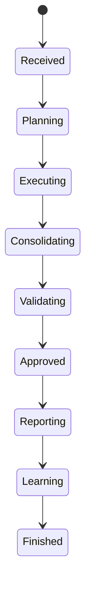
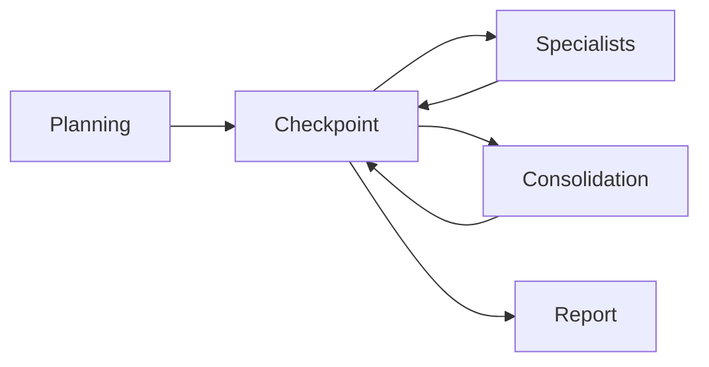

# ⚙️ Runtime Architecture

## Como o SASS-X Sentinel executa uma análise do início ao fim

> *O Runtime do SASS-X Sentinel representa o mecanismo operacional da plataforma. É responsável por transformar uma solicitação em conhecimento estruturado, coordenando especialistas digitais, consolidando evidências e produzindo recomendações rastreáveis.*

---

# Visão Geral

Cada execução do Sentinel segue um ciclo controlado.

O objetivo não é apenas produzir respostas, mas garantir que todas as análises sejam:

* reproduzíveis;
* auditáveis;
* rastreáveis;
* orientadas por evidências;
* supervisionadas quando necessário.

Cada execução possui um ciclo de vida próprio e independente.

---

# Visão do Runtime

```mermaid
flowchart LR

Request

--> Context Builder

--> Planner

--> Orchestrator

--> Specialists

--> Validation

--> Consolidation

--> Report

--> Workspace

--> Knowledge Graph
```

Cada etapa possui responsabilidades específicas e produz artefatos reutilizáveis.

---

# Ciclo de Vida da Execução

Toda solicitação percorre as mesmas fases.



Esse fluxo padroniza o comportamento da plataforma.

---

# Fase 1 — Recebimento

A execução inicia quando um evento é recebido.

Exemplos:

* solicitação via CLI;
* chamada pela API;
* Pull Request;
* Commit;
* Pipeline;
* alerta operacional;
* incidente;
* execução agendada.

Cada evento recebe um identificador único.

---

# Fase 2 — Construção do Contexto

Antes de iniciar qualquer análise, o Sentinel reúne informações relevantes.

Entre elas:

* tecnologia utilizada;
* estrutura do projeto;
* histórico de execuções;
* conhecimento previamente registrado;
* configurações da organização;
* objetivo da solicitação.

Essa etapa reduz análises desnecessárias e melhora a qualidade das recomendações.

---

# Fase 3 — Planejamento

O Planner define a estratégia de execução.

Suas responsabilidades incluem:

* selecionar capacidades;
* escolher especialistas;
* identificar dependências;
* definir ordem de execução;
* estimar esforço.

O resultado é um plano de trabalho estruturado.

---

# Fase 4 — Orquestração

O Orchestrator coordena toda a execução.

```mermaid
flowchart TB

Planner

--> Queue

Queue

--> Specialist A

Queue

--> Specialist B

Queue

--> Specialist C

Queue

--> Specialist D

Specialist A --> Consolidation

Specialist B --> Consolidation

Specialist C --> Consolidation

Specialist D --> Consolidation
```

Cada especialista recebe apenas a parte do contexto necessária para executar sua missão.

---

# Execução dos Especialistas

Cada especialista trabalha de forma independente.

Durante sua execução ele pode:

* consultar o Knowledge Graph;
* utilizar cache;
* produzir evidências;
* gerar recomendações;
* solicitar reprocessamento;
* registrar métricas.

Todos seguem contratos padronizados.

---

# Produção de Evidências

O Sentinel nunca gera conclusões sem evidências.

Cada evidência contém:

* origem;
* arquivo;
* localização;
* justificativa;
* nível de confiança;
* especialista responsável.

Essas informações tornam o processo auditável.

---

# Consolidação

Após a execução dos especialistas, inicia-se a consolidação.

Responsabilidades:

* remover duplicidades;
* correlacionar descobertas;
* calcular severidades;
* priorizar riscos;
* organizar recomendações.

O resultado é uma visão única da execução.

---

# Validação

Antes da geração dos relatórios, os resultados passam por validações.

Exemplos:

* consistência;
* completude;
* conflitos;
* evidências ausentes;
* baixa confiança.

Quando necessário, o Orchestrator solicita novas execuções.

---

# Checkpoints

Durante todo o processo são criados checkpoints.



Esses pontos permitem retomada da execução sem reiniciar todo o processo.

---

# Retry Inteligente

Nem toda falha exige reiniciar a execução completa.

O Runtime identifica exatamente quais componentes precisam ser executados novamente.

Isso reduz:

* tempo;
* custo computacional;
* consumo de tokens.

---

# Human Approval

Quando um resultado possui impacto elevado, o Runtime solicita aprovação humana.

Casos comuns:

* alterações arquiteturais;
* mudanças automáticas;
* vulnerabilidades críticas;
* ações destrutivas.

A decisão permanece sob responsabilidade do usuário.

---

# Geração de Relatórios

Após aprovação, o módulo de Reporting produz diferentes visões.

Exemplos:

* relatório técnico;
* resumo executivo;
* roadmap;
* plano de correção;
* métricas.

Todos os relatórios são armazenados no Workspace.

---

# Atualização do Conhecimento

Finalizada a execução, o aprendizado é incorporado ao Knowledge Graph.

São registrados:

* novos padrões;
* relações entre tecnologias;
* histórico de decisões;
* métricas;
* recomendações validadas.

Esse conhecimento pode ser reutilizado em futuras execuções.

---

# Observabilidade do Runtime

Todo o Runtime produz métricas.

Entre elas:

* tempo de planejamento;
* especialistas utilizados;
* tempo por capacidade;
* consumo de recursos;
* tempo de consolidação;
* utilização de cache;
* taxa de reprocessamento.

Essas métricas permitem otimização contínua da plataforma.

---

# Tratamento de Falhas

O Runtime foi projetado para tolerar falhas.

Quando um componente apresenta problemas, o sistema pode:

* repetir a execução;
* substituir especialistas;
* isolar módulos;
* registrar incidentes;
* continuar parcialmente quando possível.

O objetivo é preservar a continuidade operacional.

---

# Encerramento da Execução

Uma execução somente é considerada concluída quando:

* todas as etapas obrigatórias forem finalizadas;
* os relatórios forem persistidos;
* os checkpoints forem atualizados;
* o aprendizado for registrado;
* os indicadores forem consolidados.

Somente então o Workspace é marcado como finalizado.

---

# Resumo

O Runtime Architecture descreve como o SASS-X Sentinel transforma solicitações em conhecimento estruturado por meio de um fluxo controlado, auditável e orientado por evidências.

Sua arquitetura combina planejamento, orquestração, especialização, validação e aprendizado contínuo para oferecer análises confiáveis, escaláveis e alinhadas às necessidades da Engenharia de Software moderna.

---

## Próximo capítulo

➡ **17-knowledge-graph.md**

No próximo capítulo exploraremos o **Knowledge Graph**, a memória organizacional do Sentinel. Veremos como padrões, experiências, decisões arquiteturais e conhecimento técnico são organizados para permitir que a plataforma evolua continuamente e produza análises cada vez mais contextualizadas.
