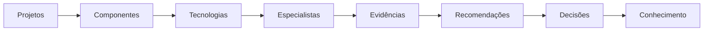
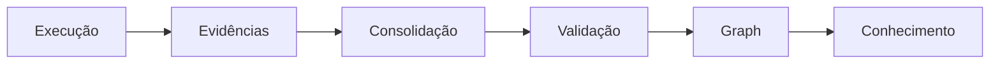

# 🧠 Engineering Intelligence Graph

## A memória organizacional do SASS-X Sentinel

> *O Engineering Intelligence Graph é o núcleo de conhecimento do SASS-X Sentinel. Ele transforma análises isoladas em inteligência reutilizável, permitindo que a plataforma evolua continuamente a partir das experiências acumuladas durante sua operação.*

<p align="center">
    
</p>

---

# Visão Geral

Toda análise realizada pelo Sentinel produz conhecimento.

Esse conhecimento não deve desaparecer ao término da execução.

Ele deve ser organizado, relacionado, validado e reutilizado.

O Engineering Intelligence Graph existe exatamente para isso.

Sua missão é transformar experiências técnicas em ativos permanentes da organização.

---

# Muito além de uma Base de Dados

O Engineering Intelligence Graph não armazena apenas informações.

Ele representa relações.

Por exemplo:

* tecnologias utilizadas;
* padrões arquiteturais;
* vulnerabilidades;
* componentes;
* especialistas;
* incidentes;
* correções;
* decisões;
* evidências.

Essas relações permitem compreender contexto, e não apenas fatos isolados.

---

# Visão Conceitual



Cada novo relacionamento amplia a capacidade analítica da plataforma.

---

# O que é armazenado

O Graph pode registrar diferentes tipos de conhecimento.

Entre eles:

* padrões arquiteturais;
* boas práticas;
* decisões aprovadas;
* histórico de análises;
* relações entre tecnologias;
* métricas;
* vulnerabilidades recorrentes;
* recomendações validadas;
* modelos de correção.

Esses elementos tornam futuras análises mais rápidas e contextualizadas.

---

# O que NÃO é armazenado

Nem toda informação deve fazer parte do conhecimento permanente.

O Sentinel evita registrar:

* segredos;
* senhas;
* tokens;
* dados pessoais;
* informações confidenciais;
* credenciais;
* artefatos temporários.

O objetivo é preservar apenas conhecimento útil e reutilizável.

---

# Tipos de Nós

O Graph é composto por diferentes categorias de entidades.

Exemplos:

```text
Projeto

Repositório

Módulo

Serviço

Tecnologia

Framework

Especialista

Achado

Recomendação

ADR

Incidente

Pipeline

Deploy

Componente

Organização
```

Cada tipo possui propriedades específicas.

---

# Tipos de Relacionamentos

As entidades são conectadas por relações semânticas.

Exemplos:

```text
USA

IMPLEMENTA

DEPENDE

CORRIGE

AFETA

ORIGINOU

RELACIONA

EXECUTOU

VALIDOU

RECOMENDA

GEROU
```

Essas conexões permitem análises muito mais ricas do que consultas tradicionais.

---

# Como o Conhecimento é Construído

Após cada execução, o Runtime envia novos fatos ao Graph.



Somente informações validadas passam a compor o conhecimento permanente.

---

# Reutilização de Conhecimento

Quando uma nova solicitação chega, o Planner consulta o Graph antes de iniciar os especialistas.

Isso permite:

* reconhecer padrões semelhantes;
* evitar análises repetidas;
* reutilizar recomendações aprovadas;
* identificar especialistas mais eficazes;
* reduzir tempo de processamento.

O conhecimento acumulado beneficia todas as execuções futuras.

---

# Aprendizado Contínuo

Cada ciclo de execução fortalece o Graph.

```mermaid
flowchart LR

Execução

--> Aprendizado

--> Knowledge

--> Próxima Execução

--> Novo Aprendizado
```

Esse processo cria uma evolução contínua da inteligência da plataforma.

---

# Inteligência Organizacional

O Graph pode representar conhecimento específico de uma organização.

Exemplos:

* padrões internos;
* frameworks adotados;
* convenções;
* políticas de segurança;
* arquitetura corporativa;
* tecnologias homologadas.

Isso permite recomendações alinhadas ao contexto da empresa.

---

# Inteligência Global

Além do conhecimento organizacional, a plataforma pode utilizar conhecimento técnico compartilhado.

Exemplos:

* OWASP;
* padrões SOLID;
* boas práticas de observabilidade;
* Design Patterns;
* guias de arquitetura.

Esse conhecimento serve como referência para análises em diferentes contextos.

---

# Controle de Qualidade

Nem todo conhecimento possui o mesmo nível de confiança.

Cada elemento pode possuir indicadores como:

* origem;
* confiabilidade;
* data de validação;
* especialista responsável;
* nível de maturidade;
* frequência de utilização.

Esses indicadores ajudam o Planner a selecionar as melhores referências.

---

# Economia de Recursos

Ao reutilizar conhecimento previamente consolidado, o Sentinel reduz:

* tempo de processamento;
* consumo de tokens;
* chamadas desnecessárias aos modelos;
* repetição de análises.

Isso melhora significativamente a eficiência operacional.

---

# Evolução do Conhecimento

O conhecimento não é estático.

Informações podem:

* evoluir;
* ser substituídas;
* perder validade;
* receber novas evidências.

A plataforma mantém histórico completo dessas mudanças.

---

# Benefícios

O Engineering Intelligence Graph oferece diversas vantagens:

* preservação do conhecimento técnico;
* redução de retrabalho;
* recomendações mais contextualizadas;
* maior velocidade de análise;
* aprendizado contínuo;
* inteligência organizacional reutilizável.

---

# Resumo

O Engineering Intelligence Graph transforma experiências de engenharia em conhecimento permanente.

Mais do que uma base de dados, ele representa a memória viva da plataforma, permitindo que o SASS-X Sentinel aprenda continuamente, reutilize conhecimento validado e ofereça análises cada vez mais inteligentes e alinhadas ao contexto de cada organização.

---

## Próximo capítulo

➡ **18-audit-workspace-model.md**

No próximo capítulo conheceremos o **Workspace**, o ambiente isolado de execução do Sentinel. Veremos como cada análise gera seu próprio espaço de trabalho, garantindo rastreabilidade, checkpoints, evidências, relatórios e reprodução completa de cada execução.
