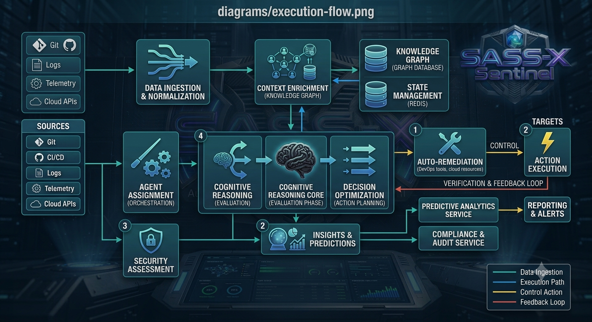
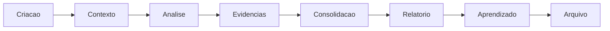
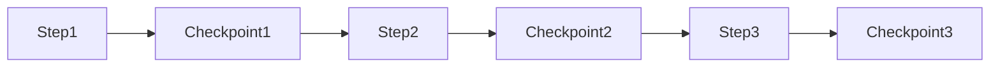
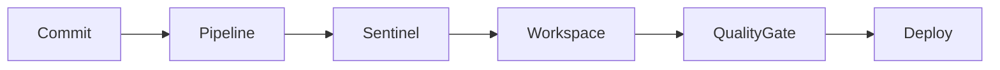

# 📁 Execution Workspace Architecture

## O ambiente de rastreabilidade e auditoria do SASS-X Sentinel

> *O Workspace representa o espaço operacional de cada execução do SASS-X Sentinel. Ele concentra contexto, evidências, checkpoints, decisões e resultados, permitindo que qualquer análise seja auditada, reproduzida e compreendida posteriormente.*

<p align="center">
    
</p>

---

# Visão Geral

Em sistemas tradicionais de análise de código, o resultado normalmente é apenas um relatório final.

O Sentinel trabalha de forma diferente.

Cada execução gera uma trilha completa de engenharia:

* o que foi analisado;
* quais especialistas participaram;
* quais evidências foram encontradas;
* quais decisões foram tomadas;
* quais recomendações foram produzidas;
* quais validações ocorreram.

Essa rastreabilidade é fundamental para ambientes corporativos.

---

# Conceito

O Workspace é uma unidade isolada de execução.

Cada demanda possui seu próprio ambiente.

Exemplo:

```text
workspace/

└── ISSUE-20260710-001/

    ├── context/

    ├── execution/

    ├── evidence/

    ├── findings/

    ├── reports/

    ├── checkpoints/

    ├── decisions/

    └── metadata.json
```

---

# Ciclo de Vida do Workspace



Cada fase possui artefatos próprios.

---

# Estrutura Interna

## Context

Responsável pelo contexto inicial.

Contém:

* solicitação original;
* projeto analisado;
* tecnologias identificadas;
* configurações;
* parâmetros da execução.

Exemplo:

```json
{
 "project":"cliente-api",
 "technology":"Spring Boot",
 "analysis":"security-review"
}
```

---

# Execution

Registra o histórico operacional.

Inclui:

* etapas executadas;
* especialistas acionados;
* tempos;
* status;
* eventos.

Exemplo:

```text
execution.log

10:01 Planner iniciado

10:02 OWASP Agent executado

10:03 Quality Agent executado

10:04 Consolidação iniciada
```

---

# Evidence Repository

O Sentinel trabalha baseado em evidências.

Esse diretório contém:

* trechos de código;
* arquivos analisados;
* logs;
* traces;
* referências.

Nenhum achado deve existir sem evidência associada.

---

# Findings

Representa os achados estruturados.

Cada achado possui contrato padronizado.

Exemplo:

```json
{
"id":"SEC-001",
"severity":"CRITICAL",
"title":"SQL Injection",
"file":"UserRepository.java",
"line":47,
"confidence":"HIGH"
}
```

---

# Reports

Camada de comunicação dos resultados.

Um mesmo Workspace pode gerar diferentes visões.

## Relatório Técnico

Destinado aos desenvolvedores.

Contém:

* detalhes;
* evidências;
* código;
* correções.

---

## Relatório Executivo

Destinado à liderança.

Contém:

* riscos;
* impacto;
* indicadores;
* recomendações.

---

## Roadmap de Correção

Destinado ao planejamento.

Contém:

* prioridades;
* esforço;
* dependências;
* sequência recomendada.

---

# Checkpoints

O Sentinel foi projetado para execuções longas.

Por isso cada etapa gera checkpoints.



Benefícios:

* retomada após interrupção;
* auditoria;
* recuperação de estado;
* redução de processamento.

---

# Diário de Bordo

Cada execução possui um histórico narrativo.

Exemplo:

```text
ISSUE-001-DIARY.md

09:00
Execução iniciada.

09:02
Especialistas de segurança selecionados.

09:05
SQL Injection identificado.

09:07
Correção recomendada.

09:10
Aguardando aprovação humana.
```

Esse diário permite compreender como a conclusão foi alcançada.

---

# Metadata

Cada Workspace possui informações de controle.

Exemplo:

```json
{
"id":"ISSUE-001",

"created":"2026-07-10",

"status":"completed",

"agents":12,

"duration":"05m32s",

"version":"4.0"
}
```

---

# Reprodutibilidade

Uma característica fundamental do Workspace é permitir reprodução.

Com todos os artefatos armazenados é possível:

* revisar uma análise antiga;
* comparar versões;
* validar melhorias;
* investigar decisões.

---

# Auditoria Corporativa

Em ambientes regulados, o Workspace funciona como trilha de auditoria.

Permite responder perguntas como:

* Quem solicitou a análise?
* Qual código foi analisado?
* Quais agentes participaram?
* Qual evidência justificou o risco?
* Qual decisão foi tomada?

---

# Integração com CI/CD

O Workspace pode ser criado automaticamente em eventos como:



Assim, cada mudança pode possuir sua própria inteligência de engenharia associada.

---

# Política de Retenção

Organizações podem definir políticas próprias:

* manter todos os relatórios;
* arquivar apenas resultados finais;
* manter apenas riscos críticos;
* eliminar artefatos temporários.

A política pode variar conforme requisitos de compliance.

---

# Segurança do Workspace

O Workspace deve proteger informações sensíveis.

Princípios:

* isolamento por execução;
* controle de acesso;
* criptografia;
* mascaramento de dados;
* remoção de segredos.

---

# Benefícios

O modelo Workspace proporciona:

* rastreabilidade completa;
* auditoria;
* recuperação de execução;
* transparência;
* confiança nas recomendações;
* histórico organizacional.

---

# Resumo

O Workspace transforma cada análise do SASS-X Sentinel em uma execução documentada e auditável.

Ele garante que decisões tomadas pela plataforma possam ser compreendidas, revisadas e reproduzidas, criando confiança para adoção em ambientes corporativos críticos.

---

## Próximo capítulo

➡ **19-agent-framework.md**

No próximo capítulo será apresentado o framework interno de especialistas digitais, explicando como novos agentes são criados, quais contratos devem seguir, como colaboram entre si e como a plataforma garante consistência entre centenas de especialistas.
