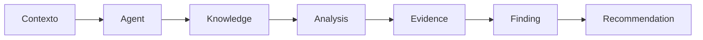
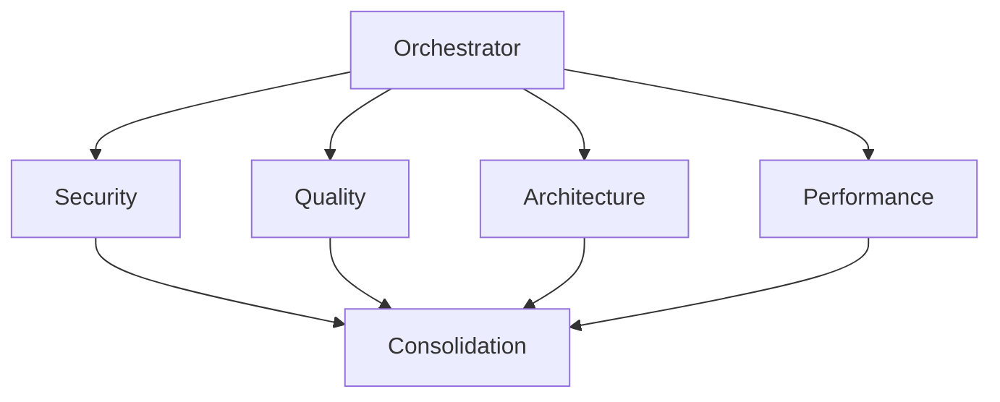
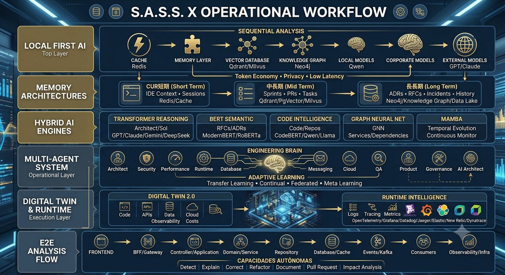

# 🤖 Agent Framework

## O framework de especialistas digitais do SASS-X Sentinel

> *O Agent Framework é a base que permite ao SASS-X Sentinel evoluir continuamente. Ele define como especialistas digitais são criados, integrados, executados e aprimorados dentro da plataforma.*

---

# Visão Geral

O SASS-X Sentinel não foi criado para possuir apenas alguns agentes fixos.

Ele foi projetado como uma plataforma capaz de crescer através de especialistas digitais.

Cada especialista representa uma capacidade de engenharia.

Exemplos:

* Segurança;
* Qualidade;
* Arquitetura;
* Performance;
* Observabilidade;
* Compliance;
* DevOps;
* Cloud;
* Banco de Dados.

---

# Conceito de Especialista Digital

Um agente Sentinel é um especialista autônomo com uma responsabilidade bem definida.

Ele possui:

```text
Especialista

├── Missão

├── Conhecimento

├── Regras

├── Entradas

├── Processamento

├── Evidências

├── Saídas

└── Métricas
```

---

# Arquitetura do Agente



O agente não apenas responde.

Ele analisa, fundamenta e recomenda.

---

# Contrato de Especialista

Todos os especialistas seguem um contrato comum.

Esse contrato garante:

* previsibilidade;
* integração;
* consolidação automática;
* rastreabilidade.

Exemplo:

```json
{
 "agent":"OWASP-Agent",

 "mission":"Security Analysis",

 "input":"Source Code",

 "output":"Validated Findings",

 "confidence":"HIGH"
}
```

---

# Categorias de Especialistas

## Security Agents

Responsáveis por segurança.

Exemplos:

* OWASP Analyzer;
* Secrets Detection;
* Dependency Security;
* LGPD Analyzer.

---

## Quality Agents

Responsáveis pela qualidade do software.

Exemplos:

* Clean Code;
* SOLID Analyzer;
* Code Smell Detection;
* Refactoring Advisor.

---

## Architecture Agents

Avaliam decisões estruturais.

Exemplos:

* Microservices Analyzer;
* Design Pattern Advisor;
* Coupling Detector.

---

## Reliability Agents

Avaliam estabilidade operacional.

Exemplos:

* Performance Analyzer;
* Resilience Checker;
* Observability Agent.

---

# Comunicação entre Especialistas

Especialistas não trabalham isoladamente.

Eles colaboram através do Orchestrator.



---

# Desenvolvimento de Novos Agentes

Criar um novo especialista segue um processo simples:

1. Definir domínio;
2. Criar contrato;
3. Adicionar conhecimento;
4. Implementar análise;
5. Validar resultados;
6. Integrar ao Orchestrator.

---

# Evolução Contínua

Novos especialistas podem surgir conforme novas necessidades aparecem.

Exemplos futuros:

* FinOps Agent;
* Data Governance Agent;
* Kubernetes Agent;
* AI Governance Agent;
* Threat Modeling Agent.

A plataforma cresce junto com os desafios da engenharia moderna.

---

# Métricas dos Especialistas

Cada agente possui indicadores próprios.

Exemplos:

* quantidade de análises;
* precisão;
* confiança média;
* tempo de execução;
* correções aceitas;
* reincidência de problemas.

---

# Benefícios

O Agent Framework proporciona:

* extensibilidade;
* especialização;
* evolução contínua;
* governança;
* colaboração entre inteligências artificiais.

---

# Resumo

O Agent Framework transforma o SASS-X Sentinel em uma plataforma aberta para criação de especialistas digitais.

Sua arquitetura permite que novas capacidades sejam adicionadas continuamente, criando um ecossistema capaz de acompanhar a evolução da Engenharia de Software.

---

# 🛰️ SASS-X Sentinel

# O Futuro da Engenharia de Software Autônoma

---

# Conclusão da Plataforma

## Engenharia de Software entrando em uma nova era

Durante décadas, a Engenharia de Software evoluiu através de ferramentas.

Primeiro vieram as IDEs.

Depois frameworks.

Depois automações.

Depois DevOps.

Depois Cloud.

Agora estamos entrando em uma nova fase:

## Engenharia Inteligente Assistida por Agentes.

O SASS-X Sentinel nasce dentro dessa nova realidade.

---

# O Sentinel não substitui engenheiros.

Ele amplia capacidades humanas.

Ele funciona como um parceiro técnico permanente capaz de:

* analisar;
* questionar;
* encontrar riscos;
* sugerir melhorias;
* preservar conhecimento;
* apoiar decisões.

---

# O problema que o Sentinel resolve

Organizações modernas possuem:

* milhões de linhas de código;
* arquiteturas complexas;
* múltiplas tecnologias;
* equipes distribuídas;
* conhecimento fragmentado.

Manter qualidade, segurança e evolução tornou-se um desafio enorme.

O Sentinel transforma esse desafio em inteligência operacional.

---

# A visão

O objetivo do SASS-X Sentinel é criar uma nova categoria de plataforma:

# Engineering Intelligence Platform

Uma camada inteligente que acompanha o ciclo completo do software:

```mermaid
flowchart LR

Ideia

--> Desenvolvimento

--> Pull Request

--> Testes

--> Deploy

--> Produção

--> Aprendizado

--> Evolução
```

---

# O diferencial

O Sentinel combina:

🧠 Inteligência Artificial
🤖 Agentes Especializados
🏗 Arquitetura de Software
🔐 Segurança
📊 Observabilidade
📚 Conhecimento Organizacional
⚙️ Automação

Em uma única plataforma.

---

# De ferramenta para parceiro de engenharia

O grande objetivo do Sentinel não é apenas detectar problemas.

É ajudar organizações a construir software melhor.

Mais seguro.

Mais resiliente.

Mais inteligente.

Mais sustentável.

---

# O futuro

A visão de longo prazo é que toda organização possa possuir uma camada permanente de inteligência acompanhando seus sistemas.

Um verdadeiro:

# 🛰️ Sentinela Digital da Engenharia

Observando.

Analisando.

Aprendendo.

Protegendo.

<p align="center">
    
</p>

E ajudando equipes humanas a tomar melhores decisões. Segura está!

---

# Status Atual

## SASS-X Sentinel v1.0

✅ Arquitetura multiagente
✅ Framework extensível
✅ Auditoria baseada em evidências
✅ Workspace rastreável
✅ Knowledge Graph
✅ Relatórios inteligentes
✅ Human-in-the-loop
✅ Pronto para evolução enterprise

---

# Convite

O SASS-X Sentinel está aberto para colaboração, evolução e parcerias.

Se você acredita que a próxima geração de Engenharia de Software será construída pela união entre conhecimento humano e inteligência artificial, este projeto foi criado para essa jornada.

---

# 🚀 SASS-X Sentinel

## A inteligência que acompanha a evolução do software.

*"O código muda todos os dias.
O conhecimento precisa evoluir junto."*

---

## 👤 Autor & Engenharia

<p align="center">
    
</p>

<table align="center">
  <tr>
    <td align="center">
      <a href="https://github.com/saulomcosta">
        <br />
        <sub><b>Saulo M. Costa</b></sub>
      </a>
    </td>
    <td>
      <h3><b>Senior Software Engineer | AI Solutions Architect</b></h3>
      <p>🚀 Especialista em Arquitetura de Software e na criação de Agentes de IA Autônomos.</p>
      <p>⚙️ Desenvolvendo sistemas altamente escaláveis e resilientes utilizando TypeScript, Java, AWS e Microsserviços.</p>
      <p>
        <a href="https://github.com/saulomcosta" target="_blank">
          
        </a>
        <a href="https://www.linkedin.com/in/saulo-m-costa/" target="_blank">
          
        </a>
      </p>
    </td>
  </tr>

**Versão:** 1.0
**Categoria:** Engineering Intelligence Platform
**Status:** Em evolução contínua 🚀
